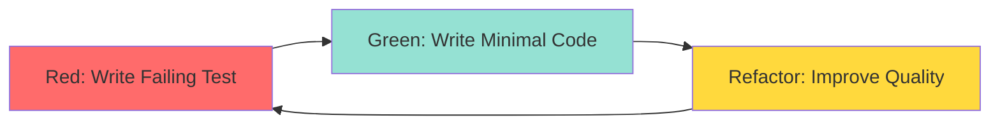

# Skill Commands

Skill commands provide specialized capabilities beyond the core Double Diamond workflow. Each skill focuses on a specific domain expertise.

---

## `/octo:debate` - AI Debate Hub

**Structured three-way debates between Claude, Gemini, and Codex.**

### Syntax

```bash
/octo:debate "<debate topic>"
/octo:debate should we use Redis or Memcached?
/octo:debate TypeScript vs JavaScript for this project
```

### What It Does

Orchestrates a structured debate with:
- **Three participants**: Claude (moderator), Gemini, Codex
- **Multiple rounds**: Opening, rebuttals, synthesis
- **Consensus building**: Final recommendation with confidence score
- **Adversarial mode**: Red team vs blue team critique

### Debate Structure

1. **Round 1 - Opening Statements**
   - Each AI presents their position
   - Initial arguments and evidence
   
2. **Round 2 - Rebuttals**
   - Respond to other perspectives
   - Address counterarguments
   
3. **Round 3 - Synthesis**
   - Claude moderates consensus
   - Final recommendation with reasoning

### Interactive Questions

Before debate, you'll be asked:

1. **Debate style**: Collaborative vs Adversarial
2. **Depth**: Quick (2 rounds) vs Deep (3+ rounds)
3. **Decision urgency**: High stakes vs exploratory

### Examples

<CodeGroup>
```bash Technology Choice
/octo:debate "Should we use PostgreSQL or MongoDB?"
# Three-way analysis of trade-offs
```

```bash Architecture Decision
/octo:debate "Microservices vs monolith for our scale?"
# Multi-perspective architectural analysis
```

```bash Security Approach
/octo:debate "JWT vs session tokens for authentication?"
# Security-focused debate with trade-offs
```

```bash Adversarial Review
/octo:debate --mode adversarial "Review this authentication logic"
# Red team vs blue team security critique
```
</CodeGroup>

### When to Use

<Check>**Use debate for:**</Check>
- Comparing technology options
- Architecture decisions with trade-offs
- Security approach evaluation
- Adversarial code review
- High-stakes technical choices

### Output

```
🐙 AI DEBATE: Redis vs Memcached

🔴 Codex Perspective:
[Technical implementation focus...]

🟡 Gemini Perspective:
[Ecosystem and operational focus...]

🔵 Claude Synthesis:
[Balanced recommendation...]

Consensus: 85% confidence
Recommendation: Redis for persistent caching with rich data structures
```

### Natural Language Triggers

Auto-activates when you say:
- "should", "vs", "or", "compare"
- "versus", "decide", "which is better"
- "debate", "argue for/against"

---

## `/octo:review` - Code Review

**Expert code review with comprehensive quality assessment.**

### Syntax

```bash
/octo:review "<code or path>"
/octo:review src/auth.ts
/octo:review "review this authentication module"
```

### What Gets Reviewed

<AccordionGroup>
  <Accordion title="Code Quality" icon="code">
    - Design patterns and architecture
    - Code complexity (cyclomatic)
    - Maintainability and readability
    - Naming conventions
    - Code duplication
  </Accordion>
  
  <Accordion title="Security" icon="shield">
    - OWASP Top 10 vulnerabilities
    - Authentication/authorization flaws
    - Input validation
    - SQL injection and XSS risks
    - Sensitive data exposure
  </Accordion>
  
  <Accordion title="Performance" icon="gauge">
    - Algorithm efficiency
    - Database query optimization
    - Memory usage
    - Caching opportunities
    - Scalability issues
  </Accordion>
  
  <Accordion title="Best Practices" icon="star">
    - Industry standards
    - Framework conventions
    - Error handling
    - Logging and monitoring
    - Test coverage
  </Accordion>
</AccordionGroup>

### Interactive Questions

Before review, you'll be asked:

1. **Goal**: Pre-commit / Security focus / Performance / Architecture
2. **Priority concerns**: Security / Performance / Maintainability / Testing
3. **Audience**: Just me / Team review / Production release / External audit

### Review Types

<Tabs>
  <Tab title="Quick Review">
    **Pre-commit checks** - Fast validation before committing
    
    ```bash
    /octo:quick-review
    ```
    
    - Surface-level checks (5-10 sec)
    - Critical issues only
    - Best for small changes
  </Tab>
  
  <Tab title="Full Review">
    **Comprehensive analysis** - Deep dive with multiple AI perspectives
    
    ```bash
    /octo:review src/api/
    ```
    
    - Multi-AI validation
    - Security + performance + quality
    - Best for feature completion
  </Tab>
  
  <Tab title="Security Focus">
    **Security-first audit** - OWASP compliance and vulnerability detection
    
    ```bash
    /octo:review --focus security src/auth/
    ```
    
    - Vulnerability scanning
    - Threat modeling
    - Best for critical paths
  </Tab>
</Tabs>

### Examples

<CodeGroup>
```bash Pre-Commit Check
/octo:review "quick review before I commit this"
# Fast validation of staged changes
```

```bash Security Audit
/octo:review "review auth.ts for security vulnerabilities"
# Deep security-focused analysis
```

```bash Full Module Review
/octo:review src/api/endpoints/
# Comprehensive quality, security, and performance review
```

```bash Production Readiness
/octo:review "validate payment processing for production"
# All-aspects review for deployment
```
</CodeGroup>

### Output Format

```
🐙 Code Review Results

📊 Overall Score: 8.2/10

🔴 Critical Issues (2):
  - SQL injection vulnerability in query builder (line 45)
  - Unvalidated user input in API endpoint (line 78)

🟡 Warnings (5):
  - Missing error handling in async function (line 23)
  - Performance: N+1 query pattern (line 102)
  ...

🟢 Strengths:
  - Good separation of concerns
  - Comprehensive test coverage (87%)
  - Clear documentation

💡 Recommendations:
  1. Use parameterized queries for SQL (priority: HIGH)
  2. Add input validation middleware (priority: HIGH)
  3. Implement query caching (priority: MEDIUM)
```

---

## `/octo:security` - Security Audit

**OWASP compliance and vulnerability detection.**

### Syntax

```bash
/octo:security "<code or path>"
/octo:security src/auth/
/octo:security "audit the payment processing module"
```

### What Gets Audited

<CardGroup cols={2}>
  <Card title="OWASP Top 10" icon="list">
    - Injection flaws
    - Broken authentication
    - Sensitive data exposure
    - XML external entities
    - Broken access control
    - Security misconfiguration
    - XSS vulnerabilities
    - Insecure deserialization
    - Known vulnerable components
    - Insufficient logging
  </Card>
  
  <Card title="Authentication & Auth" icon="key">
    - Password storage (hashing/salting)
    - Session management
    - Token security (JWT/OAuth)
    - Authorization logic
    - Multi-factor authentication
  </Card>
  
  <Card title="Input Validation" icon="filter">
    - SQL injection prevention
    - XSS protection
    - Command injection
    - Path traversal
    - LDAP/XML injection
  </Card>
  
  <Card title="Data Protection" icon="lock">
    - Encryption at rest/transit
    - Cryptographic implementations
    - Key management
    - PII handling
    - GDPR/HIPAA compliance
  </Card>
</CardGroup>

### Interactive Questions

1. **Threat model**: Standard web app / High-value target / Compliance-driven / API-focused
2. **Compliance requirements**: None / OWASP / GDPR/HIPAA/PCI / SOC2/ISO27001
3. **Risk tolerance**: Strict zero-trust / Balanced / Pragmatic / Development-only

### Examples

<CodeGroup>
```bash Authentication Audit
/octo:security "audit authentication module for OWASP compliance"
# Comprehensive auth security review
```

```bash API Security
/octo:security src/api/ --compliance PCI
# API security with payment card compliance
```

```bash Adversarial Testing
/octo:security --mode adversarial src/
# Red team security testing
```
</CodeGroup>

### Output Format

```
🛡️ Security Audit Report

Threat Level: MEDIUM
Compliance: OWASP Top 10

🔴 CRITICAL (1):
  - SQL Injection vulnerability (CWE-89)
    Location: src/db/query.ts:45
    Fix: Use parameterized queries
    
🟠 HIGH (3):
  - Weak password hashing (bcrypt rounds < 10)
  - Missing CSRF protection
  - Sensitive data in logs
  
🟡 MEDIUM (7):
  ...

Recommendations:
  1. Implement prepared statements (IMMEDIATE)
  2. Increase bcrypt work factor to 12 (HIGH)
  3. Add CSRF tokens to forms (HIGH)
```

---

## `/octo:tdd` - Test-Driven Development

**Red-green-refactor discipline with multi-AI test generation.**

### Syntax

```bash
/octo:tdd "<feature to implement>"
/octo:tdd implement user registration
/octo:tdd "build JWT authentication with tests first"
```

### TDD Workflow



### What You Get

1. **Test-First**: Failing tests written before implementation
2. **Minimal Code**: Only enough code to pass tests
3. **Refactor**: Clean up with confidence (tests protect you)
4. **Coverage**: High test coverage by design
5. **Regression Protection**: Catch breaks early

### Interactive Questions

1. **Coverage goal**: Critical paths / Standard ~80% / Comprehensive >90% / Mutation testing
2. **Test style**: Unit tests / Integration / E2E / Mix of all
3. **Complexity**: Simple CRUD / Moderate logic / Complex algorithms / Distributed systems

### Examples

<CodeGroup>
```bash Simple Feature
/octo:tdd "implement user registration with validation"
# Test-first development with red-green-refactor
```

```bash API Endpoint
/octo:tdd "create RESTful user management API"
# Tests before implementation
```

```bash Complex Logic
/octo:tdd "build rate limiting with Redis"
# TDD for complex distributed feature
```
</CodeGroup>

### TDD Cycle Example

<Steps>
  <Step title="Red: Write Failing Test">
    ```typescript
    // test/auth.test.ts
    describe('User Registration', () => {
      it('should reject weak passwords', async () => {
        const result = await register({ password: '123' });
        expect(result.error).toBe('Password too weak');
      });
    });
    ```
    
    Test fails ❌ (no implementation yet)
  </Step>
  
  <Step title="Green: Write Minimal Code">
    ```typescript
    // src/auth.ts
    export function register({ password }) {
      if (password.length < 8) {
        return { error: 'Password too weak' };
      }
      return { success: true };
    }
    ```
    
    Test passes ✅
  </Step>
  
  <Step title="Refactor: Improve Quality">
    ```typescript
    // src/auth.ts
    const MIN_PASSWORD_LENGTH = 8;
    
    export function register({ password }: RegisterInput): RegisterResult {
      const validation = validatePassword(password);
      if (!validation.isValid) {
        return { error: validation.message };
      }
      return { success: true };
    }
    ```
    
    Tests still pass ✅, code is cleaner
  </Step>
  
  <Step title="Repeat">
    Add next failing test, implement, refactor...
  </Step>
</Steps>

### When to Use TDD

<Check>**Use TDD for:**</Check>
- Critical business logic
- Complex algorithms
- Features with clear requirements
- When you need high confidence
- Legacy code refactoring

<Warning>**Consider alternatives for:**</Warning>
- Prototypes and spikes
- UI/UX experimentation
- Unclear requirements (use `/octo:discover` first)

---

## `/octo:factory` - Dark Factory Mode

**Spec-in, software-out autonomous pipeline.**

### Syntax

```bash
/octo:factory --spec <path-to-spec>
/octo:factory --spec specs/auth-system.md
```

### What It Does

**7-phase autonomous pipeline:**

<Steps>
  <Step title="1. Parse Spec">
    Validates NLSpec format and extracts:
    - Satisfaction target (0.80-0.99)
    - Complexity estimate
    - Behaviors and constraints
  </Step>
  
  <Step title="2. Generate Scenarios">
    Multi-provider scenario generation:
    - Codex: Technical scenarios
    - Gemini: User scenarios
    - Claude: Edge cases
  </Step>
  
  <Step title="3. Split Holdout">
    80/20 train/test split:
    - 80% used for implementation
    - 20% held back for blind validation
  </Step>
  
  <Step title="4. Embrace Workflow">
    Full 4-phase implementation:
    - Discover → Define → Develop → Deliver
    - Fully autonomous (no phase approval)
  </Step>
  
  <Step title="5. Holdout Tests">
    Blind evaluation:
    - Test implementation against withheld scenarios
    - Measure actual vs expected behavior
  </Step>
  
  <Step title="6. Score Satisfaction">
    Weighted scoring:
    - Behavior coverage: 40%
    - Constraint adherence: 20%
    - Holdout pass rate: 25%
    - Code quality: 15%
  </Step>
  
  <Step title="7. Generate Report">
    Verdict with evidence:
    - PASS (>= target)
    - WARN (>= target - 0.05)
    - FAIL (< target - 0.05)
  </Step>
</Steps>

### Interactive Questions

1. **Spec path**: Where is the NLSpec file?
2. **Satisfaction target**: Use spec default or override? (0.80-0.99)
3. **Cost confirmation**: Proceed with ~$0.50-2.00 cost? (~20-30 agent calls)

### Options

<ParamField path="--spec" type="string" required>
  Path to NLSpec file defining the feature
</ParamField>

<ParamField path="--holdout-ratio" type="number" default="0.25">
  Percentage of scenarios for blind validation (0.20-0.30)
</ParamField>

<ParamField path="--max-retries" type="number" default="2">
  Number of retry attempts on FAIL verdict
</ParamField>

<ParamField path="--ci" type="boolean">
  Non-interactive mode for automation pipelines
</ParamField>

### Examples

<CodeGroup>
```bash Standard Factory Run
/octo:factory --spec specs/user-auth.md
# Full autonomous pipeline with default settings
```

```bash CI/CD Integration
/octo:factory --spec specs/api.md --ci
# Non-interactive mode for automated pipelines
```

```bash Custom Holdout
/octo:factory --spec specs/payment.md --holdout-ratio 0.30
# Use 30% holdout for extra validation rigor
```
</CodeGroup>

### Output Structure

```
.octo/factory/<run-id>/
  ├── factory-report.md           # Human-readable report
  ├── factory-session.json        # Machine-readable summary
  ├── scenarios.json              # All generated scenarios
  ├── holdout.json               # Withheld scenarios
  ├── embrace-results/           # Implementation artifacts
  └── validation-results.json    # Holdout test results
```

### When to Use Factory

<Check>**Use factory for:**</Check>
- Features with clear specifications
- Autonomous development pipelines
- CI/CD integration
- When you have a complete NLSpec
- Spec-driven development

<Warning>**Don't use for:**</Warning>
- Simple bug fixes
- Exploratory coding
- Unclear requirements (use `/octo:plan` first)
- Tasks without specifications

### Cost & Duration

- **Cost**: ~$0.50-2.00 per run (20-30 agent calls)
- **Duration**: 15-30 minutes depending on complexity
- **Retries**: Auto-retry on FAIL (up to max-retries)

---

## `/octo:prd` - PRD Generation

**AI-optimized Product Requirements Document with 100-point scoring.**

### Syntax

```bash
/octo:prd "<feature description>"
/octo:prd "user authentication system"
/octo:prd "build a notification center"
```

### What You Get

Comprehensive PRD with:

1. **Executive Summary** - Vision and key value proposition
2. **Problem Statement** - Quantified by user segment
3. **Goals & Metrics** - SMART goals with P0/P1/P2 priorities
4. **Non-Goals** - Explicit scope boundaries
5. **User Personas** - 2-3 specific personas with needs
6. **Functional Requirements** - FR-001 format with acceptance criteria
7. **Implementation Phases** - Dependency-ordered rollout
8. **Risks & Mitigations** - Identified risks with mitigation plans

### Interactive Questions

Phase 0 clarification (mandatory):

1. **Target Users**: Who will use this? (developers/end-users/admins/agencies)
2. **Core Problem**: What pain point does this solve? Metrics?
3. **Success Criteria**: How will you measure success? KPIs?
4. **Constraints**: Technical, budget, timeline, platform constraints?
5. **Existing Context**: Greenfield or integrating with existing systems?

### Scoring Framework (100 points)

| Category | Points | Criteria |
|----------|--------|----------|
| **AI-Specific Optimization** | 25 | Structured for AI consumption, clear acceptance criteria |
| **Traditional PRD Core** | 25 | Problem statement, goals, requirements clarity |
| **Implementation Clarity** | 30 | Phasing, dependencies, technical feasibility |
| **Completeness** | 20 | All sections present, personas defined, risks identified |

### Examples

<CodeGroup>
```bash User Feature
/octo:prd "build user profile management system"
# Complete PRD with personas and requirements
```

```bash Technical Feature
/octo:prd "implement real-time notification service"
# PRD with technical architecture and phasing
```

```bash Platform Feature
/octo:prd "create admin dashboard for analytics"
# PRD with multiple user personas and use cases
```
</CodeGroup>

### Output Example

```markdown
# PRD: User Authentication System

## Executive Summary
[Vision and value proposition...]

## Problem Statement
Current state: Users authenticate via third-party OAuth only...
Target state: Support multiple auth methods with SSO...
Metrics: 30% of users request alternative login methods...

## Goals & Metrics
| Priority | Goal | Metric | Target |
|----------|------|--------|--------|
| P0 | Support email/password | Adoption rate | 40% of users |
| P1 | Implement SSO | Enterprise signups | +25% |
| P2 | Add 2FA | Security incidents | -50% |

## Functional Requirements
FR-001: User Registration
  - User can create account with email + password
  - Acceptance: Email verification sent within 30s
  ...

[Self-Score: 87/100]
```

---

## `/octo:claw` - OpenClaw Administration

**Manage OpenClaw gateway instances across platforms.**

### Syntax

```bash
/octo:claw "<admin task>"
/octo:claw check health
/octo:claw update to latest
/octo:claw setup on docker
```

### What It Manages

<CardGroup cols={2}>
  <Card title="Gateway Lifecycle" icon="power-off">
    - Start/stop/restart gateway
    - Health checks and diagnostics
    - Daemon installation
    - Version updates and rollback
  </Card>
  
  <Card title="5 Platforms" icon="server">
    - **macOS**: launchd service
    - **Ubuntu/Debian**: systemd service
    - **Docker**: compose orchestration
    - **OCI (ARM)**: ARM-optimized containers
    - **Proxmox**: LXC containers
  </Card>
  
  <Card title="6 Channels" icon="message">
    - WhatsApp
    - Telegram
    - Discord
    - Slack
    - Signal
    - iMessage
  </Card>
  
  <Card title="Security" icon="shield">
    - Security audit and hardening
    - Firewall configuration
    - Tailscale VPN setup
    - Credential management
    - SSL/TLS configuration
  </Card>
</CardGroup>

### Methodology

Every claw action follows:

1. **DETECT** - Identify platform (never assume OS)
2. **DIAGNOSE** - Non-destructive checks before changes
3. **EXECUTE** - Platform-specific commands
4. **VERIFY** - Confirm the change took effect

### Examples

<CodeGroup>
```bash Health Check
/octo:claw "check if my gateway is healthy"
# Platform detection + diagnostics
```

```bash Update Gateway
/octo:claw "update openclaw to latest stable"
# Backup + upgrade + verify
```

```bash Channel Setup
/octo:claw "configure telegram channel"
# Bot token setup + webhook config
```

```bash Security Hardening
/octo:claw "harden my server"
# Firewall + fail2ban + SSH hardening
```

```bash Tailscale VPN
/octo:claw "setup tailscale for remote access"
# Tailscale install + auth + routing
```
</CodeGroup>

### Platform-Specific Commands

<Tabs>
  <Tab title="macOS">
    ```bash
    # Start/stop gateway (launchd)
    launchctl load ~/Library/LaunchAgents/com.openclaw.gateway.plist
    launchctl unload ~/Library/LaunchAgents/com.openclaw.gateway.plist
    
    # Check logs
    log show --predicate 'subsystem == "com.openclaw.gateway"' --last 1h
    ```
  </Tab>
  
  <Tab title="Ubuntu/Debian">
    ```bash
    # Start/stop gateway (systemd)
    sudo systemctl start openclaw-gateway
    sudo systemctl stop openclaw-gateway
    
    # Check status
    sudo systemctl status openclaw-gateway
    sudo journalctl -u openclaw-gateway --since "1 hour ago"
    ```
  </Tab>
  
  <Tab title="Docker">
    ```bash
    # Start/stop gateway (compose)
    docker-compose -f openclaw-gateway.yml up -d
    docker-compose -f openclaw-gateway.yml down
    
    # Check logs
    docker-compose logs -f gateway
    ```
  </Tab>
</Tabs>

### When to Use Claw

- Managing OpenClaw gateway instances
- Platform-specific administration tasks
- Channel configuration (WhatsApp, Telegram, etc.)
- Security hardening and VPN setup
- Troubleshooting gateway issues
- Multi-platform deployments

<Info>
`/octo:claw` is specifically for OpenClaw gateway administration. For general system commands, use `/octo:setup` or `/octo:doctor`.
</Info>

---

## Planning & Orchestration Skills

### `/octo:plan` - Strategic Planning

**Create execution plans without running them.**

See [Workflow Commands - Plan](/commands/workflow-commands#plan) for details.

### `/octo:parallel` - Team of Teams

**Decompose work into parallel packages.**

```bash
/octo:parallel "build e-commerce platform"
# Breaks into: auth, catalog, cart, payment, shipping packages
```

### `/octo:multi` - Force Multi-Provider

**Manual override for parallel execution.**

```bash
/octo:multi "What is OAuth?"
# Forces Codex + Gemini + Claude even for simple question
```

### `/octo:spec` - NLSpec Authoring

**Write structured natural language specifications.**

```bash
/octo:spec "authentication system"
# Generates NLSpec with behaviors, actors, constraints
```

---

## Skill Comparison

| Skill | Multi-AI | Duration | Cost | Use Case |
|-------|----------|----------|------|----------|
| `/octo:debate` | Yes | 5-10 min | ~$0.08-0.20 | Compare options, adversarial review |
| `/octo:review` | Yes | 3-8 min | ~$0.05-0.15 | Code quality assessment |
| `/octo:security` | Yes | 3-8 min | ~$0.05-0.15 | OWASP audit, vulnerability scan |
| `/octo:tdd` | Yes | 10-20 min | ~$0.15-0.40 | Test-first implementation |
| `/octo:factory` | Yes | 15-30 min | ~$0.50-2.00 | Spec-to-software pipeline |
| `/octo:prd` | Yes | 5-10 min | ~$0.08-0.20 | Product requirements |
| `/octo:claw` | No | 2-5 min | Free | OpenClaw administration |

---

## Next Steps

<CardGroup cols={3}>
  <Card title="Try a Debate" icon="comments" href="/quickstart">
    Compare options with multi-AI perspectives
  </Card>
  <Card title="Code Review" icon="magnifying-glass" href="/quickstart">
    Get comprehensive quality assessment
  </Card>
  <Card title="Workflow Commands" icon="diagram-project" href="/commands/workflow-commands">
    Learn the core Double Diamond phases
  </Card>
</CardGroup>
