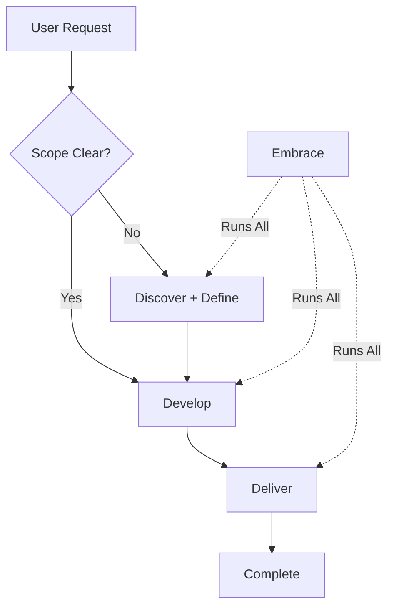

# Workflow Commands

Claude Octopus implements the Double Diamond methodology through four core workflow phases. Each phase can be run independently or as part of the complete `/octo:embrace` workflow.

## Double Diamond Phases

The Double Diamond methodology divides work into four distinct phases:


<AccordionGroup>
  <Accordion title="Phase 1: Discover (Probe)" icon="magnifying-glass">
    **Divergent thinking** - Broad exploration and research
    
    - Multi-perspective research using Claude + Gemini + Codex
    - Explore problem space and gather options
    - Identify patterns, best practices, and trade-offs
    - Generate comprehensive understanding before narrowing
  </Accordion>
  
  <Accordion title="Phase 2: Define (Grasp)" icon="bullseye">
    **Convergent thinking** - Narrow down and clarify scope
    
    - Build consensus on requirements using multi-AI analysis
    - Lock in scope and boundaries
    - Clarify problem statement and constraints
    - Define success criteria and edge cases
  </Accordion>
  
  <Accordion title="Phase 3: Develop (Tangle)" icon="code">
    **Divergent thinking** - Generate multiple implementation approaches
    
    - Multiple AI perspectives on implementation
    - Code generation and technical patterns
    - Quality gate validation (75% consensus threshold)
    - Security checks and best practices enforcement
  </Accordion>
  
  <Accordion title="Phase 4: Deliver (Ink)" icon="check-circle">
    **Convergent thinking** - Validate and finalize
    
    - Multi-AI validation and review
    - Security audit (OWASP compliance)
    - Edge case analysis and testing
    - Final quality synthesis and recommendations
  </Accordion>
</AccordionGroup>

---

## `/octo:embrace` - Full Workflow

**Complete Double Diamond workflow from research to delivery.**

### Syntax

```bash
/octo:embrace "<natural language description>"
/octo:embrace build user authentication system
/octo:embrace create payment processing feature
```

### What It Does

Runs all four phases sequentially:
1. **Discover** - Multi-provider research
2. **Define** - Consensus building on approach
3. **Develop** - Implementation with quality gates
4. **Deliver** - Final validation and review

### Options

<ParamField path="--autonomy" type="string" default="supervised">
  Control execution flow:
  - `supervised` - Pause after each phase for approval (default)
  - `semi-autonomous` - Only pause on quality gate failures
  - `autonomous` - Run all 4 phases without intervention
</ParamField>

<ParamField path="--scope" type="string">
  Project scope from clarifying questions:
  - `small` - Single component or small addition
  - `medium` - Multiple components, moderate complexity
  - `large` - System-wide changes or new subsystem
  - `full` - Complete application or major architecture
</ParamField>

### Interactive Questions

Before execution, Claude asks 3 clarifying questions:

1. **Scope**: What's the project size? (small/medium/large/full)
2. **Focus Areas**: What needs attention? (architecture/security/performance/UX)
3. **Autonomy**: How much oversight? (supervised/semi-auto/autonomous/manual)

### Examples

<CodeGroup>
```bash Supervised Mode (Default)
/octo:embrace "implement OAuth authentication"
# Pauses after each phase for review and approval
```

```bash Autonomous Mode
export OCTOPUS_AUTONOMY=autonomous
/octo:embrace "build notification system"
# Runs all 4 phases automatically
```

```bash With Explicit Flag
/octo:embrace --autonomy semi-autonomous "create API rate limiter"
# Only pauses if quality gates fail
```
</CodeGroup>

### When to Use

<Check>**Use embrace for:**</Check>
- Complex features requiring research → implementation
- High-stakes projects needing validation
- Features where you want multiple AI perspectives
- When you need structured quality gates

<Warning>**Don't use for:**</Warning>
- Simple bug fixes or edits
- Quick research-only tasks (use `/octo:discover`)
- Code review only (use `/octo:deliver`)

### Quality Gates

The develop phase includes automatic validation:
- 75% consensus threshold across AI providers
- Security checks (OWASP Top 10)
- Best practices verification
- Performance considerations

### Results

Artifacts saved to:
```
~/.claude-octopus/results/
  ├── probe-synthesis-<timestamp>.md     # Discover phase
  ├── grasp-consensus-<timestamp>.md      # Define phase
  ├── tangle-validation-<timestamp>.md    # Develop phase
  └── delivery-<timestamp>.md             # Deliver phase
```

---

## `/octo:discover` (Probe)

**Discovery phase - Multi-AI research and exploration.**

### Syntax

```bash
/octo:discover "<research topic>"
/octo:discover OAuth security patterns
/octo:probe database architectures for multi-tenant SaaS
```

<Info>**Alias:** `/octo:probe` - Alternative name from Double Diamond methodology</Info>

### What You Get

- Multi-AI research (Claude + Gemini + Codex + Perplexity)
- Comprehensive analysis of options and trade-offs
- Best practice identification
- Implementation considerations
- Technical patterns and ecosystem overview

### Interactive Questions

1. **Depth**: How deep should research go? (quick/moderate/comprehensive/deep)
2. **Focus**: Primary area? (technical/best-practices/ecosystem/trade-offs)
3. **Output**: Format preference? (detailed-report/summary/comparison/recommendations)

### Examples

<CodeGroup>
```bash Quick Overview
/octo:discover "OAuth 2.0 authentication flows"
# 1-2 min surface-level scan
```

```bash Deep Research
/octo:discover "microservices vs monolith architecture trade-offs"
# 4-5 min exhaustive analysis with multiple perspectives
```

```bash Ecosystem Focus
/octo:probe "state management libraries for React"
# Focus on tools, community, and comparisons
```
</CodeGroup>

### When to Use

- Starting a new feature
- Researching technologies or patterns
- Exploring design options
- Understanding problem space
- Gathering requirements

### Natural Language Triggers

Auto-activates when you say:
- "research", "investigate", "explore"
- "probe", "study", "analyze"
- "learn about", "understand"

---

## `/octo:define` (Grasp)

**Definition phase - Clarify and scope with multi-AI consensus.**

### Syntax

```bash
/octo:define "<problem or feature>"
/octo:define requirements for user authentication
/octo:grasp scope of notification system
```

<Info>**Alias:** `/octo:grasp` - Alternative name from Double Diamond methodology</Info>

### What You Get

- Multi-AI consensus on requirements
- Clear problem statement
- Scoped requirements with boundaries
- Edge case identification
- Constraint analysis
- Technical requirements definition

### Examples

<CodeGroup>
```bash Clarify Requirements
/octo:define "what does the payment system need to do?"
# Multi-AI consensus on functional requirements
```

```bash Scope Feature
/octo:grasp "notification system boundaries and constraints"
# Clear scope with what's in/out
```

```bash Problem Understanding
/octo:define "help me understand the caching problem"
# Clarify the core issue before implementing
```
</CodeGroup>

### When to Use

<Check>**Use define when you need:**</Check>
- Requirements clarification: "Define requirements for X"
- Scope boundaries: "What exactly does X need to do?"
- Problem understanding: "Help me understand the problem with Y"
- Consensus building: Multiple AI perspectives on the approach

<Warning>**Don't use for:**</Warning>
- Implementation (use `/octo:develop`)
- Research (use `/octo:discover`)
- Review (use `/octo:deliver`)

### Natural Language Triggers

Auto-activates when you say:
- "define", "clarify", "scope"
- "what exactly", "help me understand"
- "requirements for", "boundaries of"

---

## `/octo:develop` (Tangle)

**Development phase - Build with multi-AI implementation and quality gates.**

### Syntax

```bash
/octo:develop "<implementation task>"
/octo:develop build user authentication
/octo:tangle implement OAuth 2.0 flow
```

<Info>**Alias:** `/octo:tangle` - Alternative name from Double Diamond methodology</Info>

### What You Get

- Multi-AI implementation (Claude + Gemini + Codex)
- Multiple implementation approaches
- Quality gate validation (75% consensus)
- Security checks (OWASP compliance)
- Best practices enforcement
- Performance considerations

### Quality Gates

Automatic validation includes:
- **Consensus threshold**: 75% agreement across AI providers
- **Security**: OWASP Top 10 compliance checks
- **Best practices**: Industry-standard patterns
- **Performance**: Scalability and efficiency review

### Examples

<CodeGroup>
```bash Standard Implementation
/octo:develop "build JWT authentication middleware"
# Multi-AI implementation with quality gates
```

```bash Complex Feature
/octo:tangle "create rate limiting system with Redis"
# Multiple approaches with consensus validation
```

```bash API Development
/octo:develop "implement RESTful user management API"
# Code generation with security and best practices
```
</CodeGroup>

### When to Use

<Check>**Use develop when you need:**</Check>
- Building: "Build X" or "Implement Y"
- Creating: "Create Z feature"
- Code generation: "Write code to do Y"
- Multiple implementation perspectives

<Warning>**Don't use for:**</Warning>
- Simple code edits (use Edit tool)
- Reading or reviewing code (use Read/review)
- Trivial single-file changes

### Natural Language Triggers

Auto-activates when you say:
- "build", "create", "implement"
- "develop", "code", "write"
- "make" (with specific target)

---

## `/octo:deliver` (Ink)

**Delivery phase - Review, validate, and test with multi-AI quality assurance.**

### Syntax

```bash
/octo:deliver "<validation task>"
/octo:deliver review authentication implementation
/octo:ink validate API security
```

<Info>**Alias:** `/octo:ink` - Alternative name from Double Diamond methodology</Info>

### What You Get

- Multi-AI validation (Claude + Gemini + Codex)
- Security audit (OWASP compliance, vulnerability detection)
- Code quality review
- Edge case analysis
- Performance evaluation
- Comprehensive recommendations

### Audit Coverage

<AccordionGroup>
  <Accordion title="Security Audit" icon="shield">
    - OWASP Top 10 vulnerabilities
    - Authentication/authorization flaws
    - Input validation and sanitization
    - SQL injection and XSS risks
    - Cryptography and data protection
  </Accordion>
  
  <Accordion title="Code Quality" icon="code">
    - Design patterns and architecture
    - Code complexity and maintainability
    - Error handling
    - Test coverage
    - Documentation quality
  </Accordion>
  
  <Accordion title="Performance" icon="gauge">
    - Scalability issues
    - Inefficient algorithms
    - Resource usage
    - Caching opportunities
    - Database query optimization
  </Accordion>
  
  <Accordion title="Edge Cases" icon="exclamation-triangle">
    - Boundary conditions
    - Error scenarios
    - Race conditions
    - Concurrency issues
    - Input validation gaps
  </Accordion>
</AccordionGroup>

### Examples

<CodeGroup>
```bash Security Review
/octo:deliver "review authentication for security vulnerabilities"
# Comprehensive security audit with OWASP compliance
```

```bash Quality Validation
/octo:ink "validate API implementation for production"
# Multi-AI quality assurance and best practices
```

```bash Pre-Deploy Check
/octo:deliver "final review of payment processing code"
# Edge cases, security, and performance validation
```
</CodeGroup>

### When to Use

<Check>**Use deliver when you need:**</Check>
- Review: "Review X" or "Code review Y"
- Validation: "Validate Z implementation"
- Testing: "Test the feature"
- Quality check: "Check if X works correctly"

<Warning>**Don't use for:**</Warning>
- Implementation (use `/octo:develop`)
- Research (use `/octo:discover`)
- Requirements (use `/octo:define`)

### Natural Language Triggers

Auto-activates when you say:
- "review", "validate", "check"
- "audit", "inspect", "verify"
- "test", "quality check"

---

## Workflow Comparison

| Command | Phase | Thinking | Multi-AI | Duration | Output |
|---------|-------|----------|----------|----------|--------|
| `/octo:discover` | 1 | Divergent | Yes | 2-5 min | Research synthesis |
| `/octo:define` | 2 | Convergent | Yes | 1-3 min | Requirements doc |
| `/octo:develop` | 3 | Divergent | Yes | 3-8 min | Implementation |
| `/octo:deliver` | 4 | Convergent | Yes | 2-5 min | Validation report |
| `/octo:embrace` | 1-4 | Both | Yes | 8-20 min | Complete delivery |

## Phase Dependencies



## Next Steps

<CardGroup cols={2}>
  <Card title="Try the Full Workflow" icon="rocket" href="/quickstart">
    Start with `/octo:embrace` for a complete feature
  </Card>
  <Card title="System Commands" icon="gear" href="/commands/system-commands">
    Configure your environment and providers
  </Card>
</CardGroup>
