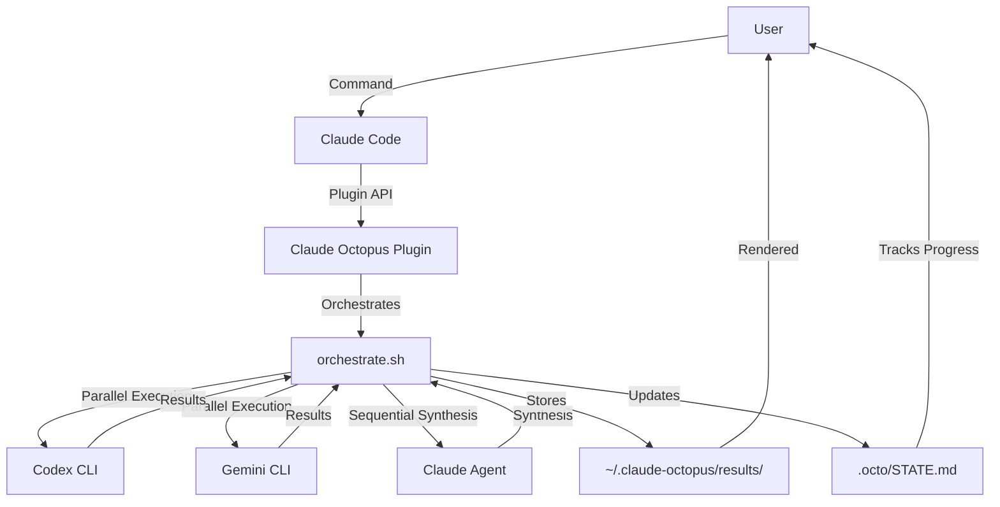
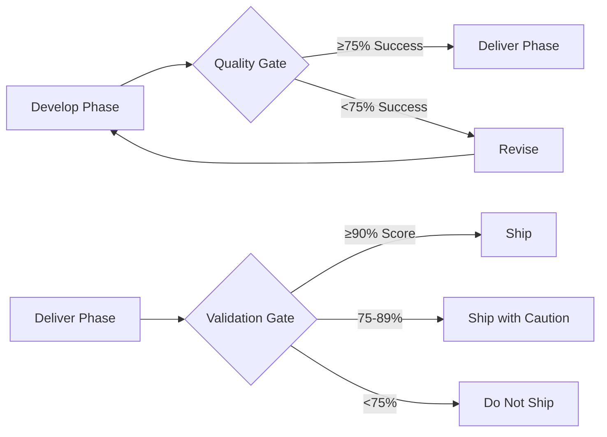

## Overview

Claude Octopus is a multi-AI orchestration framework that coordinates three AI providers through a plugin architecture for Claude Code. The system turns one model into three, assigning each provider a distinct role with adversarial review and consensus gates.

<Note>
Claude Octopus works with just Claude out of the box. Add Codex or Gemini to unlock multi-AI orchestration features.
</Note>

## Core components

The system is built from four main components that work together:

<CardGroup cols={2}>
  <Card title="orchestrate.sh" icon="gears">
    The orchestration engine that coordinates all AI providers and manages workflow execution
  </Card>
  <Card title="Agents & Personas" icon="users">
    33 specialized personas that activate automatically based on task requirements
  </Card>
  <Card title="Skills & Workflows" icon="wand-magic-sparkles">
    39 commands implementing Double Diamond phases and specialized workflows
  </Card>
  <Card title="Hooks & State" icon="link">
    Event-driven hooks and persistent state management for session continuity
  </Card>
</CardGroup>

## Component interaction



### Data flow

1. **User request** - Natural language or command triggers a workflow
2. **Plugin routing** - Claude Octopus parses intent and selects appropriate skill
3. **Orchestration** - `orchestrate.sh` coordinates provider execution:
   - Parallel for research and review phases
   - Sequential for definition and synthesis
   - Adversarial for debate and validation
4. **Provider execution** - External CLIs execute with isolated environments
5. **Consensus building** - 75% agreement threshold enforced at quality gates
6. **Result synthesis** - Claude combines perspectives into unified output
7. **State persistence** - Decisions and context stored in `.octo/` and `~/.claude-octopus/`

## Plugin architecture for Claude Code

Claude Octopus integrates with Claude Code through a structured plugin system:

### Directory structure

```
claude-octopus/
├── .claude/
│   ├── commands/          # 39 slash commands (/octo:embrace, etc.)
│   ├── skills/            # Workflow implementations (flow-discover.md, etc.)
│   ├── agents/            # Agent definitions
│   │   └── personas/      # 33 specialized personas
│   ├── hooks/             # Event-driven lifecycle hooks
│   └── state/             # State management utilities
├── scripts/
│   ├── orchestrate.sh     # Main orchestration engine
│   ├── provider-router.sh # Provider selection and routing
│   ├── state-manager.sh   # Persistent state management
│   └── metrics-tracker.sh # Cost and token tracking
└── .octo/                 # Project-specific state (gitignored)
    ├── STATE.md           # Current phase and progress
    └── decisions.json     # Architectural decisions
```

### Plugin lifecycle

<Steps>
  <Step title="Installation">
    User installs via `/plugin install claude-octopus@nyldn-plugins`
  </Step>
  <Step title="Setup">
    `/octo:setup` detects available providers and configures authentication
  </Step>
  <Step title="Activation">
    Commands trigger via `/octo:*` prefix or natural language with `octo` keyword
  </Step>
  <Step title="Execution">
    Hooks fire on SessionStart, SubagentStart, ConfigChange, WorktreeCreate events
  </Step>
  <Step title="State management">
    Decisions persist across sessions in `.octo/` directory and `~/.claude-octopus/`
  </Step>
</Steps>

## Execution model

### Provider coordination

Claude Octopus assigns specific roles to each AI provider:

| Provider | Role | Best For |
|----------|------|----------|
| **Codex (OpenAI)** | Implementation depth | Code patterns, technical analysis, architecture design |
| **Gemini (Google)** | Ecosystem breadth | Research synthesis, alternatives, security review |
| **Claude (Anthropic)** | Orchestration & synthesis | Quality gates, consensus building, strategic synthesis |

<Info>
Providers run with isolated environments (v8.7.0+) to prevent API key leakage and limit environment variable access.
</Info>

### Execution patterns

Different workflows use different execution patterns:

<Tabs>
  <Tab title="Parallel">
    **Discover & Deliver phases**
    
    ```bash
    # Both providers run simultaneously
    codex exec "analyze patterns" &
    gemini -p "" -o text "research ecosystem" &
    wait
    
    # Claude synthesizes after both complete
    claude --print "synthesize results"
    ```
    
    **Benefits:** Faster execution, diverse perspectives
  </Tab>
  
  <Tab title="Sequential">
    **Define phase**
    
    ```bash
    # Step-by-step refinement
    codex exec "define problem statement"
    gemini -p "" "define success criteria"
    gemini -p "" "define constraints"
    gemini -p "" "build consensus"
    ```
    
    **Benefits:** Coherent problem definition, builds on prior steps
  </Tab>
  
  <Tab title="Adversarial">
    **Debate workflow**
    
    ```bash
    # Round 1: All providers give independent analysis
    codex exec "position A" &
    gemini -p "" "position B" &
    claude --print "independent analysis" &
    wait
    
    # Round 2+: Rebuttals and counter-arguments
    # (repeat as needed)
    
    # Final: Claude moderates and synthesizes
    claude --print "synthesize consensus"
    ```
    
    **Benefits:** Catches blind spots, adversarial testing
  </Tab>
</Tabs>

### Quality gates

Quality gates enforce standards between workflow phases:



**Consensus threshold:** 75% (configurable via `CLAUDE_OCTOPUS_QUALITY_THRESHOLD`)

**Measured by:**
- Subtask success rate during development
- Agreement score across providers
- Validation score during review

## Security architecture

### Environment isolation (v8.7.0+)

External providers run with minimal environment access:

```bash
# Codex: Only essential variables
env -i PATH="$PATH" HOME="$HOME" \
  OPENAI_API_KEY="$OPENAI_API_KEY" \
  TMPDIR="/tmp" \
  codex exec "prompt"

# Gemini: Only essential variables  
env -i PATH="$PATH" HOME="$HOME" \
  GEMINI_API_KEY="$GEMINI_API_KEY" \
  NODE_NO_WARNINGS=1 TMPDIR="/tmp" \
  gemini -p "" "prompt"
```

### Trust markers

Provider outputs are wrapped with trust indicators:

```xml
<external-cli-output provider="codex" trust="untrusted">
  [Provider output here]
</external-cli-output>
```

Claude outputs pass through unchanged (trusted by default).

### Integrity verification

Result files are hashed (SHA-256) and tracked in `.integrity-manifest` to detect tampering.

## Cost transparency

Visual indicators show exactly which providers are active:

| Indicator | Meaning | Cost Source |
|-----------|---------|-------------|
| 🐙 | Claude Octopus multi-AI mode active | Multiple APIs |
| 🔴 | Codex CLI executing | User's OPENAI_API_KEY |
| 🟡 | Gemini CLI executing | User's GEMINI_API_KEY |
| 🔵 | Claude subagent processing | Included with Claude Code |

**Example banner:**
```
🐙 CLAUDE OCTOPUS ACTIVATED - Multi-provider research mode
🔍 Discover Phase: Researching OAuth patterns

Providers:
🔴 Codex CLI - Technical implementation analysis
🟡 Gemini CLI - Ecosystem and community research  
🔵 Claude - Strategic synthesis

💰 Estimated Cost: $0.02-0.05
⏱️  Estimated Time: 30-60 seconds
```

<Note>
Users can set `OCTOPUS_MAX_COST_USD` to enforce spending limits. Workflows abort if estimated cost exceeds the threshold.
</Note>

## Performance characteristics

### Typical execution times

| Workflow | Duration | Provider Calls |
|----------|----------|----------------|
| discover | 30-60s | 2-3 |
| define | 1-2 min | 3-4 |
| develop | 3-7 min | 4-6 |
| deliver | 2-5 min | 3-5 |
| embrace (all 4) | 5-15 min | 12-18 |
| debate | 1-3 min | 3-9 |

### Optimization strategies

<AccordionGroup>
  <Accordion title="Smart cost routing (v8.20.0+)">
    Provider router selects cheapest capable provider based on:
    - Bayesian trust scoring
    - Historical performance
    - Cost per token
    - Capability matching
  </Accordion>
  
  <Accordion title="Prompt caching">
    Repeated workflows reuse cached context:
    - System prompts cached
    - Project context cached
    - Persona definitions cached
  </Accordion>
  
  <Accordion title="Parallel execution">
    Research and review phases run providers simultaneously:
    - 2x faster than sequential
    - Better diversity of perspectives
  </Accordion>
</AccordionGroup>

## Version compatibility

Claude Octopus detects Claude Code version and adapts features:

| Claude Code Version | Features Unlocked |
|---------------------|-------------------|
| v2.1.12+ | Task management, bash wildcards |
| v2.1.16+ | Fork context, agent field |
| v2.1.32+ | Agent teams, auto memory |
| v2.1.33+ | Persistent memory, hook events |
| v2.1.36+ | Fast Opus 4.6 mode |
| v2.1.50+ | Worktree isolation, agents CLI |
| v2.1.63+ | HTTP hooks, batch command |

<Info>
Feature detection is automatic. No manual configuration needed.
</Info>

## Next steps

<CardGroup cols={2}>
  <Card title="Double Diamond methodology" icon="gem" href="/concepts/double-diamond">
    Learn about the four-phase workflow structure
  </Card>
  <Card title="Multi-AI orchestration" icon="gears" href="/concepts/multi-ai-orchestration">
    Understand how providers coordinate and reach consensus
  </Card>
  <Card title="Personas" icon="users" href="/concepts/personas">
    Explore the 33 specialized agent personas
  </Card>
  <Card title="Workflows" icon="diagram-project" href="/concepts/workflows">
    Discover workflow patterns and autonomy modes
  </Card>
</CardGroup>