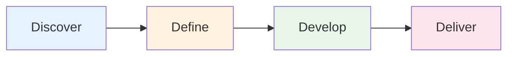
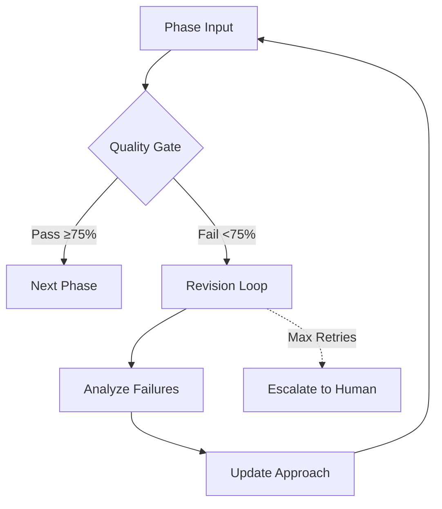
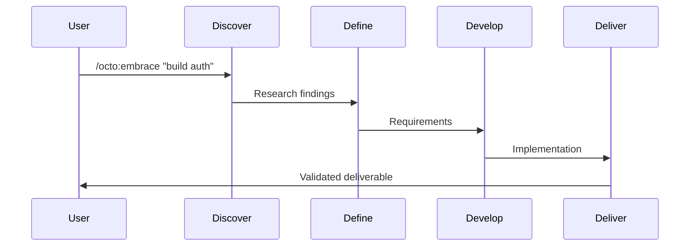

## What is Double Diamond?

The Double Diamond is a structured methodology for moving from problem to solution through four distinct phases. Claude Octopus adapts this framework from the UK Design Council to software development, adding quality gates and multi-AI orchestration.

<Note>
Other multi-AI tools give you infrastructure to build workflows on. Claude Octopus gives you the workflows.
</Note>



## The four phases

<Tabs>
  <Tab title="Discover">
    ### 🔍 Discover - Divergent exploration
    
    **Goal:** Research broadly and gather diverse perspectives
    
    **Command:** `/octo:discover` or `octo research X`
    
    **What happens:**
    - Codex and Gemini run parallel research queries
    - Each provider brings unique perspective:
      - Codex: Technical implementation details
      - Gemini: Ecosystem research and alternatives
    - Claude synthesizes findings into unified report
    
    **Example:**
    ```
    /octo:discover OAuth 2.0 patterns for multi-tenant SaaS
    ```
    
    **Typical output:**
    - Multi-source research synthesis
    - Comparative analysis of approaches
    - Ecosystem best practices
    - Security considerations
    
    **Duration:** 30-60 seconds  
    **Cost:** $0.02-0.04
  </Tab>
  
  <Tab title="Define">
    ### 🎯 Define - Convergent scoping
    
    **Goal:** Converge on clear problem definition and requirements
    
    **Command:** `/octo:define` or `octo define X`
    
    **What happens:**
    1. Codex defines core problem statement (2-3 sentences)
    2. Gemini defines success criteria (3-5 measurable goals)
    3. Gemini defines constraints and boundaries
    4. Gemini synthesizes into unified requirements
    
    **Sequential execution** ensures coherent problem definition
    
    **Example:**
    ```
    /octo:define requirements for user authentication system
    ```
    
    **Typical output:**
    - Clear problem statement
    - Measurable success criteria
    - Known constraints
    - Non-goals and boundaries
    - Requirements document
    
    **Duration:** 1-2 minutes  
    **Cost:** $0.02-0.04
  </Tab>
  
  <Tab title="Develop">
    ### 🛠️ Develop - Divergent implementation
    
    **Goal:** Explore multiple implementation approaches and merge best elements
    
    **Command:** `/octo:develop` or `octo build X`
    
    **What happens:**
    1. Codex proposes implementation approach A
    2. Gemini proposes implementation approach B
    3. Claude merges best elements from both
    4. **Quality gate** checks 75% consensus threshold
    5. If passed: Proceed; If failed: Revise and retry
    
    **Example:**
    ```
    /octo:develop user authentication with JWT tokens
    ```
    
    **Quality gate criteria:**
    - Subtask success rate ≥ 75%
    - Agreement score across providers
    - No critical conflicts
    
    **Typical output:**
    - Implementation plan
    - Code structure
    - Architecture decisions
    - Test strategy
    
    **Duration:** 3-7 minutes  
    **Cost:** $0.04-0.10
  </Tab>
  
  <Tab title="Deliver">
    ### ✅ Deliver - Convergent validation
    
    **Goal:** Adversarial review and go/no-go decision
    
    **Command:** `/octo:deliver` or `octo review X`
    
    **What happens:**
    1. Codex reviews code quality and patterns
    2. Gemini reviews security and edge cases
    3. Claude synthesizes validation report
    4. Quality score determines recommendation
    
    **Example:**
    ```
    /octo:deliver review authentication implementation
    ```
    
    **Validation thresholds:**
    | Score | Status | Recommendation |
    |-------|--------|----------------|
    | ≥ 90% | PASSED | Ship it |
    | 75-89% | WARNING | Ship with caution |
    | < 75% | FAILED | Do not ship |
    
    **Typical output:**
    - Code quality assessment
    - Security findings
    - Performance concerns
    - Go/no-go recommendation
    - Remediation steps
    
    **Duration:** 2-5 minutes  
    **Cost:** $0.02-0.06
  </Tab>
</Tabs>

## Quality gates

Quality gates enforce standards between phases and prevent low-quality work from advancing.

### Gate mechanics



### Consensus threshold

**Default:** 75% agreement across providers

**Configurable:** Set `CLAUDE_OCTOPUS_QUALITY_THRESHOLD` environment variable

```bash
# Raise bar to 85%
export CLAUDE_OCTOPUS_QUALITY_THRESHOLD=85

# Lower to 60% for exploratory work
export CLAUDE_OCTOPUS_QUALITY_THRESHOLD=60
```

<Warning>
Lowering the quality threshold below 75% may allow more work through, but reduces confidence in consensus.
</Warning>

### Gate failure handling

When a quality gate fails, Claude Octopus can:

<Steps>
  <Step title="Analyze failure">
    Identify which subtasks failed and why
  </Step>
  <Step title="Revision loop">
    Retry with updated approach (up to 3 attempts)
  </Step>
  <Step title="Human escalation">
    Present findings to user for decision
  </Step>
  <Step title="Abort">
    Stop workflow if unresolvable
  </Step>
</Steps>

## When to use each phase

### Use Discover when:

<CardGroup cols={2}>
  <Card icon="magnifying-glass">
    **Starting a project**  
    You need broad research before making decisions
  </Card>
  <Card icon="compass">
    **Exploring options**  
    You want to understand the landscape of solutions
  </Card>
  <Card icon="book">
    **Learning patterns**  
    You need to understand best practices and ecosystem
  </Card>
  <Card icon="scale-balanced">
    **Comparing approaches**  
    You want multi-perspective analysis of alternatives
  </Card>
</CardGroup>

### Use Define when:

<CardGroup cols={2}>
  <Card icon="bullseye">
    **Scope is unclear**  
    You have a vague idea but need clear requirements
  </Card>
  <Card icon="list-check">
    **Requirements needed**  
    You need structured success criteria
  </Card>
  <Card icon="map">
    **Planning architecture**  
    You need to clarify boundaries and constraints
  </Card>
  <Card icon="handshake">
    **Building consensus**  
    You need agreement on problem definition
  </Card>
</CardGroup>

### Use Develop when:

<CardGroup cols={2}>
  <Card icon="hammer">
    **Implementing features**  
    You're ready to build with clear requirements
  </Card>
  <Card icon="code">
    **Multiple approaches**  
    You want to explore implementation alternatives
  </Card>
  <Card icon="puzzle-piece">
    **Complex integration**  
    You need coordinated multi-provider implementation
  </Card>
  <Card icon="shield-check">
    **Quality matters**  
    You want quality gates during development
  </Card>
</CardGroup>

### Use Deliver when:

<CardGroup cols={2}>
  <Card icon="check-circle">
    **Code review**  
    You need adversarial review before shipping
  </Card>
  <Card icon="shield">
    **Security audit**  
    You want security-focused validation
  </Card>
  <Card icon="gauge-high">
    **Performance check**  
    You need to validate performance characteristics
  </Card>
  <Card icon="rocket">
    **Ship decision**  
    You need go/no-go recommendation
  </Card>
</CardGroup>

## Full workflow: Embrace

Run all four phases sequentially with `/octo:embrace`:



**Example:**
```bash
/octo:embrace build user authentication with OAuth 2.0
```

**What happens:**
1. **Discover** researches OAuth patterns and best practices
2. **Define** scopes requirements and success criteria
3. **Develop** implements with quality gates
4. **Deliver** validates security and performance

**Duration:** 5-15 minutes  
**Cost:** $0.10-0.30

## Autonomy modes

Claude Octopus supports three autonomy modes for multi-phase workflows:

<Tabs>
  <Tab title="Supervised">
    ### Supervised mode
    
    **Behavior:** Ask for approval before each phase
    
    **Use when:**
    - Learning the workflow
    - High-stakes projects
    - Cost-conscious development
    
    **Example:**
    ```
    🔍 Discover complete. Results in ~/.claude-octopus/results/discover.md
    
    Continue to Define phase? (y/n)
    ```
  </Tab>
  
  <Tab title="Semi-autonomous">
    ### Semi-autonomous mode
    
    **Behavior:** Continue automatically unless quality gate fails
    
    **Use when:**
    - Trusted workflow
    - Medium confidence
    - Human available for escalations
    
    **Example:**
    ```
    ✅ Quality gate passed (82% consensus)
    🛠️ Proceeding to Develop phase...
    
    ⚠️ Quality gate failed (68% consensus)
    Human review needed. Continue? (y/n)
    ```
  </Tab>
  
  <Tab title="Autonomous">
    ### Autonomous mode
    
    **Behavior:** Run all four phases without interruption
    
    **Use when:**
    - Well-understood problem
    - High confidence
    - Dark Factory mode
    
    **Example:**
    ```bash
    /octo:factory "build a CLI that converts CSV to JSON"
    
    # Runs all phases autonomously:
    # 1. Discover patterns
    # 2. Define requirements
    # 3. Develop implementation
    # 4. Deliver with tests
    # 5. Holdout testing
    # 6. Satisfaction scoring
    ```
  </Tab>
</Tabs>

## State persistence

Double Diamond workflows persist state across sessions:

### State files

```
.octo/
├── STATE.md            # Current phase, status, progress
├── decisions.json      # Architectural decisions
└── context/
    ├── discover.md     # Phase 1 findings
    ├── define.md       # Phase 2 requirements
    ├── develop.md      # Phase 3 implementation
    └── deliver.md      # Phase 4 validation
```

### Phase tracking

**STATE.md structure:**
```yaml
current_phase: 3
phase_position: "Development"
status: "in_progress"
last_updated: "2026-03-04T15:30:00Z"
quality_gates:
  discover: "passed"
  define: "passed"
  develop: "in_progress"
  deliver: "pending"
```

### Context preservation

Each phase reads context from prior phases:

```bash
# Define phase reads Discover findings
discover_context=$(state-manager.sh get_context "discover")

# Develop phase reads Define requirements  
define_context=$(state-manager.sh get_context "define")

# Deliver phase reads full project history
all_decisions=$(state-manager.sh get_decisions "all")
```

<Info>
State persists across context clears (Claude Code v2.1.63+ plan mode). Workflows automatically restore context from files.
</Info>

## Comparison with other methodologies

| Methodology | Phases | Quality Gates | Multi-AI |
|-------------|--------|---------------|----------|
| **Claude Octopus Double Diamond** | 4 (Discover, Define, Develop, Deliver) | Yes (75% threshold) | Yes (3 providers) |
| **Waterfall** | 5-7 | Minimal | No |
| **Agile** | Iterative | Story-level | No |
| **Design Thinking** | 5 (Empathize, Define, Ideate, Prototype, Test) | Minimal | No |

## Best practices

<AccordionGroup>
  <Accordion title="Start with Discover">
    Don't skip research phase, even if you think you know the answer. Multi-AI perspectives often reveal blind spots.
  </Accordion>
  
  <Accordion title="Define before Develop">
    Clear requirements save time and reduce rework. A good Define phase prevents scope creep during Develop.
  </Accordion>
  
  <Accordion title="Respect quality gates">
    If a quality gate fails, investigate why. Forcing work through gates undermines the methodology.
  </Accordion>
  
  <Accordion title="Use Deliver for all ships">
    Adversarial review catches issues before production. The small upfront cost prevents expensive bugs.
  </Accordion>
</AccordionGroup>

## Next steps

<CardGroup cols={2}>
  <Card title="Multi-AI orchestration" icon="gears" href="/concepts/multi-ai-orchestration">
    Learn how three providers coordinate and reach consensus
  </Card>
  <Card title="Workflows" icon="diagram-project" href="/concepts/workflows">
    Explore workflow patterns and composition
  </Card>
  <Card title="Get started" icon="rocket" href="/quickstart">
    Install Claude Octopus and run your first workflow
  </Card>
  <Card title="Commands reference" icon="terminal" href="/commands/overview">
    Browse all 39 available commands
  </Card>
</CardGroup>