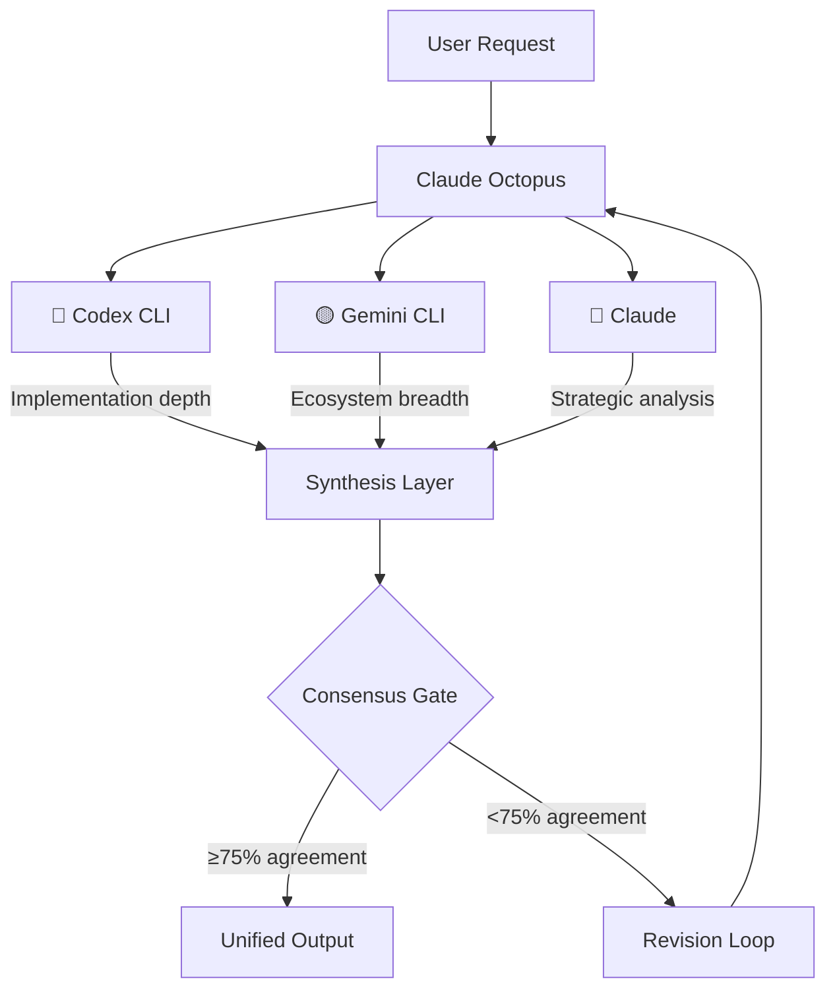
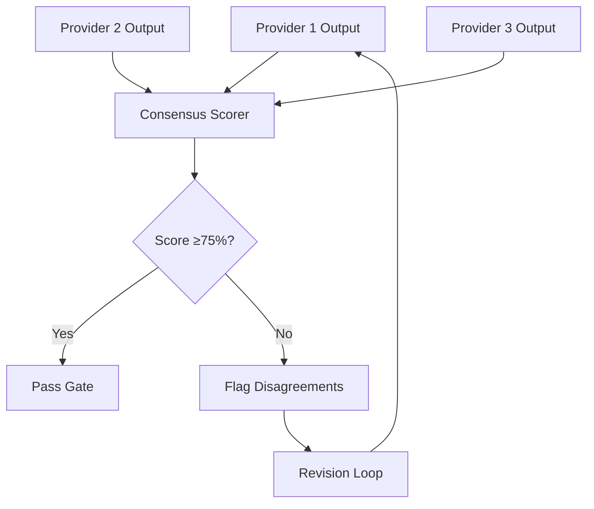
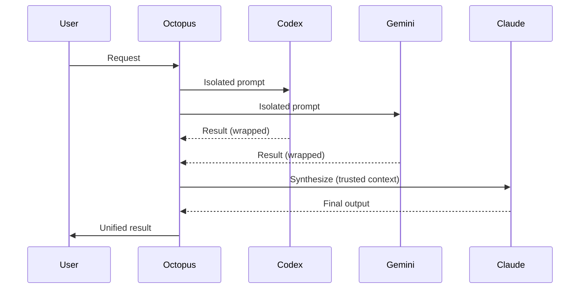

## Three providers, one workflow

Claude Octopus orchestrates Codex (OpenAI), Gemini (Google), and Claude (Anthropic) across every workflow. Each provider has a distinct role designed to leverage its unique strengths.

<Note>
You don't need all three providers. One external provider plus Claude gives you multi-AI features. No external providers still gives you 33 personas, workflows, and skills.
</Note>



## Provider roles

Each provider is assigned a specific role based on its strengths:

<CardGroup cols={3}>
  <Card title="Codex" icon="code">
    **Implementation depth**
    
    - Code generation
    - Technical analysis  
    - Architecture patterns
    - API design
    - Algorithm optimization
  </Card>
  
  <Card title="Gemini" icon="lightbulb">
    **Ecosystem breadth**
    
    - Research synthesis
    - Alternative approaches
    - Security review
    - Best practices
    - Community patterns
  </Card>
  
  <Card title="Claude" icon="brain">
    **Orchestration & synthesis**
    
    - Quality gates
    - Consensus building
    - Strategic synthesis
    - Moderation
    - Final recommendations
  </Card>
</CardGroup>

### Why these roles?

Role assignment is based on empirical testing and provider characteristics:

| Provider | Underlying Model | Key Strength | Role Assignment |
|----------|-----------------|--------------|------------------|
| **Codex** | GPT-5.3-Codex | Code generation, structured output | Implementation details |
| **Gemini** | Gemini 3.0 Pro | Research synthesis, broad knowledge | Ecosystem analysis |
| **Claude** | Sonnet 4.6 / Opus 4.6 | Nuanced reasoning, code review | Synthesis & moderation |

## Role assignment by workflow

Different workflows emphasize different provider strengths:

<Tabs>
  <Tab title="Discover">
    ### Discover phase role assignment
    
    **Execution:** Parallel (fastest)
    
    | Provider | Task | Why This Provider? |
    |----------|------|--------------------|
    | 🔴 Codex | Technical implementation analysis | Deep code pattern knowledge |
    | 🟡 Gemini | Ecosystem and community research | Broad web knowledge |
    | 🔵 Claude | Strategic synthesis | Best at combining perspectives |
    
    **Example:**
    ```bash
    # Both run simultaneously
    codex exec "analyze OAuth 2.0 implementation patterns" &
    gemini -p "" "research OAuth 2.0 ecosystem and best practices" &
    wait
    
    # Claude synthesizes
    claude --print "synthesize findings from both perspectives"
    ```
  </Tab>
  
  <Tab title="Define">
    ### Define phase role assignment
    
    **Execution:** Sequential (most coherent)
    
    | Step | Provider | Task | Why This Provider? |
    |------|----------|------|--------------------|
    | 1 | 🔴 Codex | Problem statement | Technical precision |
    | 2 | 🟡 Gemini | Success criteria | Broad perspective |
    | 3 | 🟡 Gemini | Constraints | Risk awareness |
    | 4 | 🟡 Gemini | Consensus | Synthesis capability |
    
    **Example:**
    ```bash
    codex exec "define core problem in 2-3 sentences"
    gemini -p "" "define 3-5 measurable success criteria"
    gemini -p "" "define constraints and boundaries"
    gemini -p "" "build consensus from all perspectives"
    ```
  </Tab>
  
  <Tab title="Develop">
    ### Develop phase role assignment
    
    **Execution:** Parallel proposals + sequential merge
    
    | Step | Provider | Task | Why This Provider? |
    |------|----------|------|--------------------|
    | 1 | 🔴 Codex | Implementation approach A | Code generation |
    | 1 | 🟡 Gemini | Implementation approach B | Alternative patterns |
    | 2 | 🔵 Claude | Merge best elements | Synthesis expertise |
    | 3 | All | Quality gate (75% threshold) | Consensus validation |
    
    **Example:**
    ```bash
    # Both propose approaches in parallel
    codex exec "propose implementation approach" &
    gemini -p "" "propose alternative implementation" &
    wait
    
    # Claude merges
    claude --print "merge best elements from both approaches"
    
    # All validate
    check_quality_gate  # Must reach 75% agreement
    ```
  </Tab>
  
  <Tab title="Deliver">
    ### Deliver phase role assignment
    
    **Execution:** Parallel (adversarial review)
    
    | Provider | Focus Area | Why This Provider? |
    |----------|------------|--------------------|
    | 🔴 Codex | Code quality, patterns, maintainability | Technical expertise |
    | 🟡 Gemini | Security, edge cases, compliance | Broad risk analysis |
    | 🔵 Claude | Synthesis and go/no-go decision | Nuanced judgment |
    
    **Example:**
    ```bash
    # Both review simultaneously (adversarial)
    codex exec "review code quality and patterns" &
    gemini -p "" "review security and edge cases" &
    wait
    
    # Claude synthesizes and decides
    claude --print "synthesize reviews and recommend ship/no-ship"
    ```
  </Tab>
  
  <Tab title="Debate">
    ### Debate workflow role assignment
    
    **Execution:** All three in parallel (round-robin)
    
    | Provider | Position | Why This Provider? |
    |----------|----------|--------------------|
    | 🔴 Codex | Technical perspective | Implementation depth |
    | 🟡 Gemini | Ecosystem perspective | Strategic breadth |
    | 🔵 Claude | Independent analysis + moderation | Balanced synthesis |
    
    **Example:**
    ```bash
    # Round 1: All providers give independent positions
    codex exec "argue technical perspective" &
    gemini -p "" "argue ecosystem perspective" &
    claude --print "independent analysis" &
    wait
    
    # Round 2+: Rebuttals (optional)
    # ...
    
    # Claude moderates final verdict
    claude --print "synthesize debate and recommend path"
    ```
  </Tab>
</Tabs>

## Consensus gates

Consensus gates enforce agreement thresholds before work advances.

### How consensus is measured



### Scoring methodology

Consensus score is based on:

1. **Subtask success rate** - What percentage of subtasks succeeded?
2. **Agreement score** - How similar are the provider outputs?
3. **Conflict detection** - Are there direct contradictions?

**Formula:**
```
Consensus Score = (success_rate * 0.5) + (agreement * 0.3) + (1 - conflicts * 0.2)
```

### Threshold configuration

**Default threshold:** 75%

**Override via environment variable:**
```bash
# Stricter (85% required)
export CLAUDE_OCTOPUS_QUALITY_THRESHOLD=85

# More lenient (60% required)
export CLAUDE_OCTOPUS_QUALITY_THRESHOLD=60
```

<Warning>
Lowering below 75% reduces confidence in multi-AI consensus. Use cautiously.
</Warning>

### What happens at gate failure?

<Steps>
  <Step title="Identify disagreements">
    Parse which subtasks failed and where providers disagree
  </Step>
  <Step title="Analyze root cause">
    Determine if disagreement is fundamental or resolvable
  </Step>
  <Step title="Revision attempt">
    Retry with refined prompt or additional context (max 3 attempts)
  </Step>
  <Step title="Human escalation">
    Present findings and ask user to break tie or adjust approach
  </Step>
</Steps>

## Cost transparency

Claude Octopus shows exactly which providers are running and what it costs.

### Visual indicators

Before every multi-AI workflow, you see:

```
🐙 CLAUDE OCTOPUS ACTIVATED - Multi-provider research mode
🔍 Discover Phase: Researching authentication patterns

Providers:
🔴 Codex CLI - Technical implementation analysis
🟡 Gemini CLI - Ecosystem and community research
🔵 Claude - Strategic synthesis

💰 Estimated Cost: $0.02-0.05
⏱️  Estimated Time: 30-60 seconds
```

### Provider cost breakdown

| Provider | Cost Source | Estimated Per Query |
|----------|-------------|---------------------|
| 🔴 Codex | Your `OPENAI_API_KEY` | $0.01-0.15 (depends on model) |
| 🟡 Gemini | Your `GEMINI_API_KEY` | $0.01-0.03 |
| 🔵 Claude | Included in Claude Code subscription | $0 (included) |

**Model costs (as of Feb 2026):**

<Tabs>
  <Tab title="Codex">
    | Model | Input | Output | Use Case |
    |-------|-------|--------|----------|
    | gpt-5.3-codex | $1.75/MTok | $14/MTok | Premium (default) |
    | gpt-5.3-codex-spark | $1.75/MTok | $14/MTok | Ultra-fast (1000+ tok/s) |
    | gpt-5.2-codex | $1.00/MTok | $8/MTok | Standard |
    | gpt-5.1-codex-mini | $0.30/MTok | $1.25/MTok | Budget |
  </Tab>
  
  <Tab title="Gemini">
    | Model | Input | Output | Use Case |
    |-------|-------|--------|----------|
    | gemini-3-pro-preview | ~$0.01/query | ~$0.01/query | Premium (default) |
    | gemini-3-flash-preview | ~$0.005/query | ~$0.005/query | Fast |
    | gemini-3-pro-image | ~$0.02/query | ~$0.02/query | Vision tasks |
  </Tab>
  
  <Tab title="Claude">
    | Model | Input | Output | Use Case |
    |-------|-------|--------|----------|
    | Sonnet 4.6 | Included | Included | Default (Claude Code subscription) |
    | Opus 4.6 | $5/MTok | $25/MTok | Premium reasoning (extra-usage billing) |
    | Opus 4.6 Fast | $30/MTok | $150/MTok | Low latency (6x cost, v2.1.36+) |
  </Tab>
</Tabs>

### Cost controls

<AccordionGroup>
  <Accordion title="Set spending limit">
    ```bash
    # Abort if estimated cost exceeds $0.50
    export OCTOPUS_MAX_COST_USD=0.50
    ```
    
    Workflows check estimated cost before execution and abort if over limit.
  </Accordion>
  
  <Accordion title="Smart cost routing (v8.20.0+)">
    Provider router automatically selects cheapest capable provider:
    
    - Analyzes task requirements
    - Matches to provider capabilities  
    - Selects cheapest option that can handle it
    - Falls back if first choice unavailable
  </Accordion>
  
  <Accordion title="Use fewer providers">
    Install only one external provider:
    
    - Codex only: Dual perspective (Codex + Claude)
    - Gemini only: Dual perspective (Gemini + Claude)
    - Neither: Claude-only mode (personas and workflows still work)
  </Accordion>
</AccordionGroup>

## Provider authentication

Claude Octopus supports two authentication methods:

<Tabs>
  <Tab title="OAuth (recommended)">
    ### OAuth authentication
    
    **Codex:**
    ```bash
    codex login
    # Uses your ChatGPT subscription
    # No per-token billing
    ```
    
    **Gemini:**
    ```bash
    gemini login
    # Uses your Google AI subscription
    # No per-token billing
    ```
    
    **Benefits:**
    - Included in existing subscription
    - No API key management
    - Auto-refresh tokens
  </Tab>
  
  <Tab title="API Keys">
    ### API key authentication
    
    **Codex:**
    ```bash
    export OPENAI_API_KEY="sk-..."
    ```
    
    **Gemini:**
    ```bash
    export GEMINI_API_KEY="AIza..."
    ```
    
    **Benefits:**
    - Works in CI/CD
    - Fine-grained control
    - No interactive login
    
    **Tradeoffs:**
    - Per-token billing
    - Manual key rotation
  </Tab>
</Tabs>

## Provider detection

Claude Octopus auto-detects available providers:

```bash
# Check provider status
/octo:setup

# Output:
# Providers:
#   🔴 Codex CLI: ready (OAuth authenticated)
#   🟡 Gemini CLI: ready (GEMINI_API_KEY found)
#   🔵 Claude: ready (built-in)
```

### Graceful degradation

| Available Providers | Behavior |
|--------------------|-----------|
| Codex + Gemini + Claude | Full three-way orchestration |
| Codex + Claude | Dual perspective (Codex + Claude) |
| Gemini + Claude | Dual perspective (Gemini + Claude) |
| Claude only | Single-provider mode (personas still work) |

**Workflows automatically adapt** based on what's available.

## Security considerations

### Environment isolation (v8.7.0+)

External providers run with minimal environment:

```bash
# Only essential variables passed
env -i PATH="$PATH" HOME="$HOME" \
  OPENAI_API_KEY="$key" TMPDIR="/tmp" \
  codex exec "prompt"
```

**Prevents:**
- API key leakage to external providers
- Access to sensitive environment variables
- Unintended environment pollution

### Trust markers

Provider outputs are wrapped with trust indicators:

```xml
<external-cli-output provider="codex" trust="untrusted">
  [Codex output here]
</external-cli-output>

<external-cli-output provider="gemini" trust="untrusted">
  [Gemini output here]  
</external-cli-output>
```

Claude outputs pass through unchanged (trusted by default).

### Data flow



## Best practices

<AccordionGroup>
  <Accordion title="Trust the roles">
    Don't second-guess role assignment. Codex for implementation, Gemini for ecosystem, Claude for synthesis—each provider does what it does best.
  </Accordion>
  
  <Accordion title="Respect consensus gates">
    If providers disagree significantly (less than 75% consensus), investigate why. Forcing through disagreements undermines multi-AI value.
  </Accordion>
  
  <Accordion title="Use cost controls">
    Set `OCTOPUS_MAX_COST_USD` on shared accounts or CI/CD to prevent runaway costs.
  </Accordion>
  
  <Accordion title="OAuth when possible">
    Use OAuth authentication instead of API keys—it's included in subscriptions and requires no key management.
  </Accordion>
</AccordionGroup>

## Next steps

<CardGroup cols={2}>
  <Card title="Double Diamond" icon="gem" href="/concepts/double-diamond">
    Learn about the four-phase workflow structure
  </Card>
  <Card title="Workflows" icon="diagram-project" href="/concepts/workflows">
    Explore workflow patterns and autonomy modes
  </Card>
  <Card title="Provider setup" icon="plug" href="/installation">
    Configure Codex and Gemini authentication
  </Card>
  <Card title="Cost optimization" icon="dollar-sign" href="/guides/cost-optimization">
    Learn to minimize multi-AI costs
  </Card>
</CardGroup>