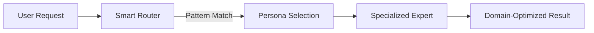
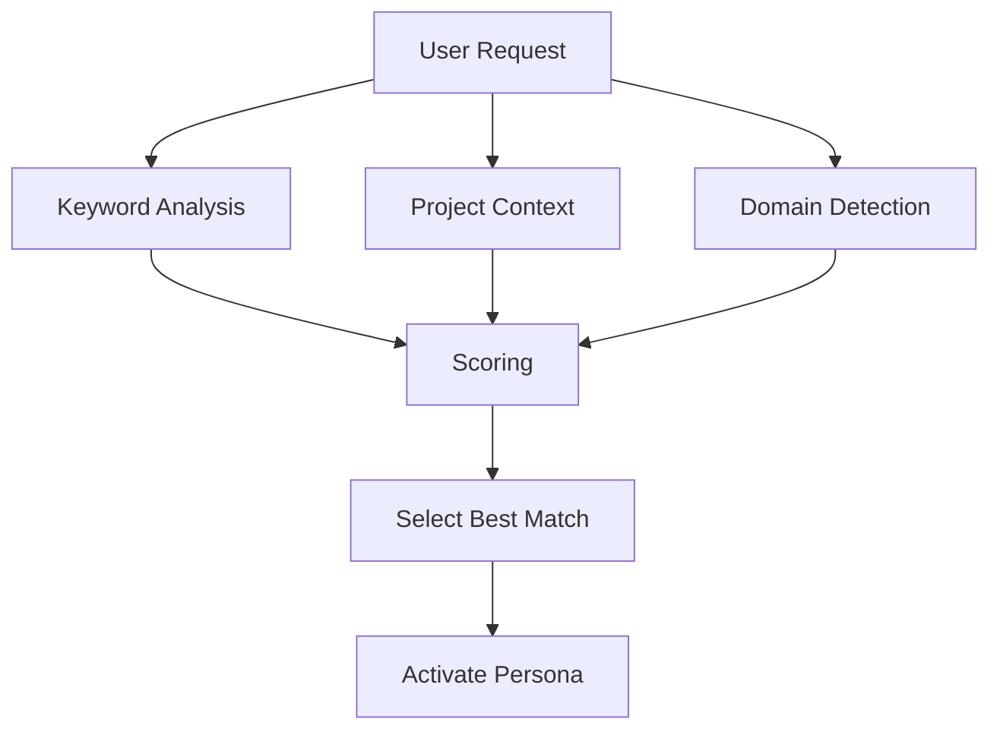
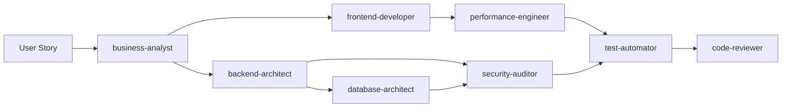

## What are personas?

Personas are specialized agent configurations that activate automatically when Claude Octopus detects matching task requirements. Each persona brings domain expertise, preferred model tier, and task-specific instructions.

<Note>
You don't invoke personas directly. Just describe what you need—Claude Octopus routes to the right expert automatically.
</Note>



## How personas work

Personas activate based on:

1. **Keywords in user request** - "debug", "audit", "optimize", etc.
2. **Project context** - File types, dependencies, existing code
3. **Task requirements** - Complexity, domain, deliverable type

**Example:**
```
User: "Audit my API for security vulnerabilities"

🔍 Detected keywords: audit, security, vulnerabilities
🔍 Project context: REST API, authentication endpoints
✅ Activated: security-auditor persona
```

## Persona categories

<Tabs>
  <Tab title="Software Engineering">
    ### Software Engineering (11 personas)
    
    Core development roles:
    
    | Persona | Superpower | Model Tier | When Auto-Activated |
    |---------|------------|------------|---------------------|
    | **backend-architect** | API design, microservices | inherit | "design API", "architect backend" |
    | **frontend-developer** | React 19, Next.js 15 | inherit | "build UI", "React component" |
    | **database-architect** | Schema design, migrations | opus | "design schema", "database structure" |
    | **cloud-architect** | AWS/GCP/Azure, IaC | opus | "deploy to AWS", "cloud infrastructure" |
    | **graphql-architect** | Federation, resolvers | opus | "GraphQL schema", "design GraphQL API" |
    | **python-pro** | Python 3.12+, FastAPI | opus | "Python code", "FastAPI service" |
    | **typescript-pro** | Advanced types, generics | opus | "TypeScript types", "strict mode" |
    | **ai-engineer** | LLM/RAG patterns | inherit | "RAG system", "prompt engineering" |
    | **code-reviewer** | Best practices, architecture | opus | "review code", "PR review" |
    | **debugger** | Error analysis, stack traces | sonnet | "debug issue", "fix error" |
    | **test-automator** | Unit/integration/E2E tests | sonnet | "write tests", "test coverage" |
  </Tab>
  
  <Tab title="Specialized Development">
    ### Specialized Development (6 personas)
    
    Focused technical roles:
    
    | Persona | Superpower | Model Tier | When Auto-Activated |
    |---------|------------|------------|---------------------|
    | **security-auditor** | OWASP, threat modeling | opus | "security audit", "find vulnerabilities" |
    | **performance-engineer** | Profiling, Core Web Vitals | inherit | "optimize performance", "profile code" |
    | **devops-troubleshooter** | K8s debugging, log analysis | sonnet | "Kubernetes issue", "deployment failed" |
    | **deployment-engineer** | CI/CD, GitHub Actions | haiku | "setup CI/CD", "deploy pipeline" |
    | **incident-responder** | SRE, on-call | sonnet | "production down", "incident response" |
    | **tdd-orchestrator** | Red-green-refactor | opus | "TDD", "test-driven" |
  </Tab>
  
  <Tab title="Documentation">
    ### Documentation & Communication (5 personas)
    
    Technical writing and knowledge work:
    
    | Persona | Superpower | Model Tier | When Auto-Activated |
    |---------|------------|------------|---------------------|
    | **docs-architect** | Technical documentation | sonnet | "write docs", "document API" |
    | **product-writer** | PRDs, user stories | sonnet | "write PRD", "user story" |
    | **exec-communicator** | Executive summaries | sonnet | "exec summary", "stakeholder brief" |
    | **academic-writer** | Research papers, citations | sonnet | "research paper", "academic writing" |
    | **mermaid-expert** | Flowcharts, diagrams | haiku | "create diagram", "flowchart" |
  </Tab>
  
  <Tab title="Research & Strategy">
    ### Research & Strategy (4 personas)
    
    Analysis and planning:
    
    | Persona | Superpower | Model Tier | When Auto-Activated |
    |---------|------------|------------|---------------------|
    | **research-synthesizer** | Literature review, gap analysis | opus | "research synthesis", "literature review" |
    | **strategy-analyst** | Market analysis, frameworks | opus | "strategy", "market analysis" |
    | **ux-researcher** | User interviews, journey mapping | opus | "user research", "UX synthesis" |
    | **business-analyst** | Requirements, stakeholder analysis | sonnet | "business requirements", "stakeholder analysis" |
  </Tab>
  
  <Tab title="Business & Compliance">
    ### Business & Compliance (3 personas)
    
    Business and legal:
    
    | Persona | Superpower | Model Tier | When Auto-Activated |
    |---------|------------|------------|---------------------|
    | **finance-analyst** | Financial models, unit economics | sonnet | "financial model", "pricing strategy" |
    | **marketing-strategist** | Campaign planning, growth funnels | sonnet | "marketing plan", "growth strategy" |
    | **legal-compliance-advisor** | GDPR, SOC 2, compliance | sonnet | "GDPR compliance", "legal review" |
  </Tab>
  
  <Tab title="Creative & Design">
    ### Creative & Design (4 personas)
    
    Design and content:
    
    | Persona | Superpower | Model Tier | When Auto-Activated |
    |---------|------------|------------|---------------------|
    | **content-analyst** | Content strategy, SEO | sonnet | "content strategy", "SEO optimization" |
    | **thought-partner** | Brainstorming, ideation | inherit | "brainstorm", "ideate" |
    | **context-manager** | Multi-agent coordination | inherit | "coordinate agents", "multi-task" |
    | **openclaw-admin** | OpenClaw framework integration | sonnet | "openclaw", "messaging integration" |
  </Tab>
</Tabs>

## Model tier system

Personas are assigned model tiers based on task complexity:

<CardGroup cols={4}>
  <Card title="Opus" icon="gem">
    **Premium**
    
    $5/$25 per MTok
    
    Critical decisions, complex reasoning
  </Card>
  <Card title="Sonnet" icon="circle">
    **Standard**
    
    Included in Claude Code subscription
    
    Focused tasks, specialized analysis
  </Card>
  <Card title="Haiku" icon="leaf">
    **Fast**
    
    Included in Claude Code subscription
    
    Simple tasks, quick responses
  </Card>
  <Card title="Inherit" icon="arrows-rotate">
    **Adaptive**
    
    Auto-selects based on complexity
    
    General-purpose roles
  </Card>
</CardGroup>

### Tier distribution

| Tier | Count | Use Cases |
|------|-------|-----------|
| **Opus** (Premium) | 8 | Architecture decisions, security audits, complex reasoning |
| **Sonnet** (Standard) | 14 | Code review, documentation, specialized analysis |
| **Haiku** (Fast) | 2 | Simple diagrams, quick deployments |
| **Inherit** (Adaptive) | 9 | General development, research, coordination |

## Automatic persona selection

Claude Octopus analyzes your request through multiple lenses:

### Pattern matching



### Selection examples

<AccordionGroup>
  <Accordion title="Backend development">
    **Request:** "Design a REST API for user authentication"
    
    **Analysis:**
    - Keywords: design, REST, API, authentication
    - Context: Backend project
    - Domain: Software engineering
    
    **Selected:** `backend-architect` (inherit tier)
  </Accordion>
  
  <Accordion title="Security audit">
    **Request:** "Audit my payment endpoint for vulnerabilities"
    
    **Analysis:**
    - Keywords: audit, payment, vulnerabilities
    - Context: API endpoint, high-risk
    - Domain: Security
    
    **Selected:** `security-auditor` (opus tier)
  </Accordion>
  
  <Accordion title="Performance optimization">
    **Request:** "Find N+1 queries in my GraphQL resolvers"
    
    **Analysis:**
    - Keywords: N+1, queries, performance
    - Context: GraphQL API
    - Domain: Performance engineering
    
    **Selected:** `performance-engineer` (inherit tier)
  </Accordion>
  
  <Accordion title="Documentation">
    **Request:** "Write API documentation for my endpoints"
    
    **Analysis:**
    - Keywords: write, documentation, API
    - Context: REST endpoints
    - Domain: Technical writing
    
    **Selected:** `docs-architect` (sonnet tier)
  </Accordion>
</AccordionGroup>

## How personas differ from general purpose

General purpose Claude vs specialized personas:

| Aspect | General Purpose | Specialized Persona |
|--------|----------------|---------------------|
| **Context** | Broad, general knowledge | Domain-specific expertise |
| **Instructions** | Generic software engineering | Tailored prompts with frameworks |
| **Model** | Default (Sonnet 4.6) | Optimized tier (opus/sonnet/haiku/inherit) |
| **Quality checks** | Basic validation | Domain-specific quality gates |
| **Output format** | Flexible | Standardized for domain |

**Example: Security audit**

<Tabs>
  <Tab title="General Purpose">
    ```
    User: Review my auth code for security issues
    
    Claude: I'll review the code. Let me check...
    [Generic code review focusing on syntax and patterns]
    ```
  </Tab>
  
  <Tab title="security-auditor Persona">
    ```
    User: Review my auth code for security issues
    
    Claude: Activating security-auditor (opus tier)...
    
    🛡️ OWASP Top 10 Analysis:
    ✓ A01:2021 - Broken Access Control
    ✗ A02:2021 - Cryptographic Failures
      ⚠️ Weak JWT secret detected
    ✓ A03:2021 - Injection
    ...
    
    [Structured security report with CVE references]
    ```
  </Tab>
</Tabs>

## Top 10 most-used personas

Based on real-world usage:

<Steps>
  <Step title="backend-architect">
    **Use:** API design, microservices, distributed systems  
    **Tier:** inherit (adapts to complexity)
  </Step>
  <Step title="code-reviewer">
    **Use:** PR reviews, architecture validation  
    **Tier:** opus (comprehensive analysis)
  </Step>
  <Step title="debugger">
    **Use:** Error analysis, stack traces, root cause  
    **Tier:** sonnet (specialized)
  </Step>
  <Step title="security-auditor">
    **Use:** OWASP audits, vulnerability scanning  
    **Tier:** opus (critical)
  </Step>
  <Step title="tdd-orchestrator">
    **Use:** Test-driven development, red-green-refactor  
    **Tier:** opus (multi-step reasoning)
  </Step>
  <Step title="frontend-developer">
    **Use:** React, Next.js, modern UI patterns  
    **Tier:** inherit (adapts)
  </Step>
  <Step title="database-architect">
    **Use:** Schema design, migrations, query optimization  
    **Tier:** opus (critical decisions)
  </Step>
  <Step title="performance-engineer">
    **Use:** Profiling, benchmarking, Core Web Vitals  
    **Tier:** inherit (adapts to depth)
  </Step>
  <Step title="python-pro">
    **Use:** Python 3.12+, FastAPI, async patterns  
    **Tier:** opus (advanced)
  </Step>
  <Step title="typescript-pro">
    **Use:** Advanced types, generics, strict TypeScript  
    **Tier:** opus (complex type systems)
  </Step>
</Steps>

## Persona composition

Multiple personas can work together in complex workflows:

### Example: Full-stack feature



**Flow:**
1. `business-analyst` clarifies requirements
2. `backend-architect` designs API
3. `frontend-developer` designs UI components
4. `database-architect` designs schema
5. `security-auditor` reviews security
6. `performance-engineer` validates performance
7. `test-automator` generates tests
8. `code-reviewer` does final review

## Creating custom personas

You can add project-specific personas:

```yaml
# agents/personas/custom-expert.md
---
name: custom-expert
description: Expert in [your domain]
model: inherit
triggers:
  - "[keyword 1]"
  - "[keyword 2]"
---

You are an expert in [domain]. You specialize in:
- [Specialization 1]
- [Specialization 2]

When analyzing tasks, you focus on:
1. [Criterion 1]
2. [Criterion 2]

Output format: [specify format]
```

Place in `.claude/agents/personas/` and Claude Octopus will auto-detect.

## Best practices

<AccordionGroup>
  <Accordion title="Let the router choose">
    Don't manually select personas. The smart router considers context you might miss. Just describe what you need naturally.
  </Accordion>
  
  <Accordion title="Trust the model tier">
    Persona tiers are optimized for cost vs quality. If a persona uses haiku, it's because the task doesn't need opus.
  </Accordion>
  
  <Accordion title="Combine with workflows">
    Personas work best inside workflows (`/octo:embrace`, `/octo:develop`, etc.) where quality gates validate their work.
  </Accordion>
  
  <Accordion title="Review persona decisions">
    Check which persona activated with `/octo:status`. If wrong persona selected, refine your request keywords.
  </Accordion>
</AccordionGroup>

## Persona reference

Full persona catalog: [docs/AGENTS.md](https://github.com/nyldn/claude-octopus/blob/main/docs/AGENTS.md)

**Quick lookup:**

| You Need... | Use This Persona | Command Example |
|-------------|------------------|------------------|
| API design | `backend-architect` | `/octo:develop design REST API` |
| Security scan | `security-auditor` | `/octo:security audit auth endpoints` |
| Bug fix | `debugger` | `/octo:debug JWT validation error` |
| Test writing | `test-automator` | `/octo:tdd create user registration` |
| Code review | `code-reviewer` | `/octo:review` |
| Schema design | `database-architect` | `/octo:define database schema` |
| Performance | `performance-engineer` | `/octo:review find N+1 queries` |
| Documentation | `docs-architect` | `/octo:docs API reference` |

## Next steps

<CardGroup cols={2}>
  <Card title="Workflows" icon="diagram-project" href="/concepts/workflows">
    Learn about workflow patterns that use personas
  </Card>
  <Card title="Commands reference" icon="terminal" href="/commands/overview">
    Browse all 39 commands and their personas
  </Card>
  <Card title="Agent catalog" icon="book" href="https://github.com/nyldn/claude-octopus/blob/main/docs/AGENTS.md">
    Full persona documentation with triggers
  </Card>
  <Card title="Double Diamond" icon="gem" href="/concepts/double-diamond">
    Understand the four-phase workflow structure
  </Card>
</CardGroup>