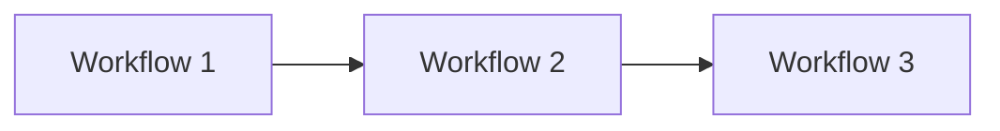
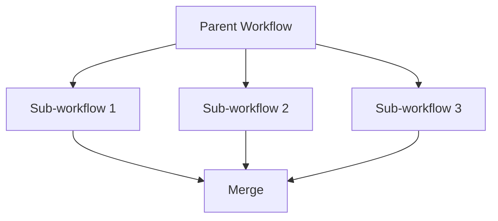
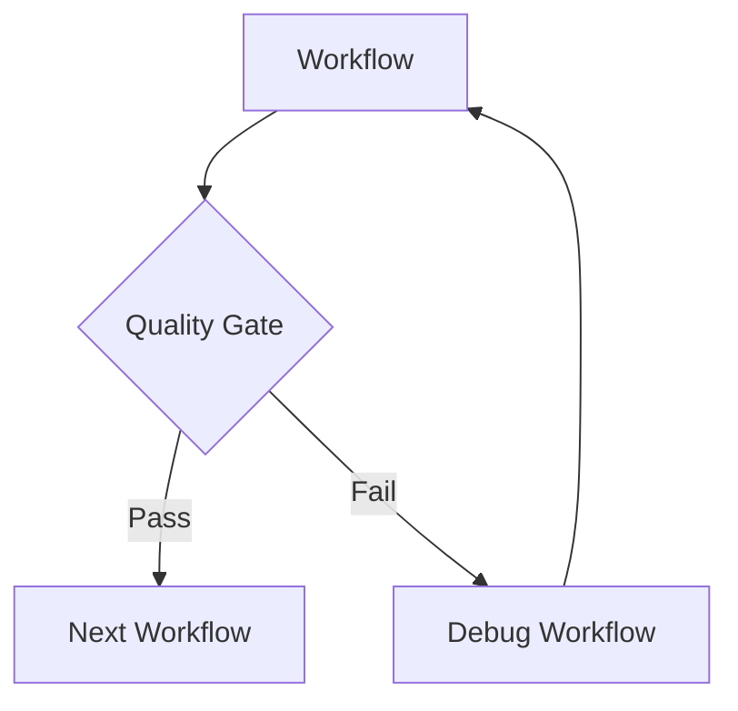
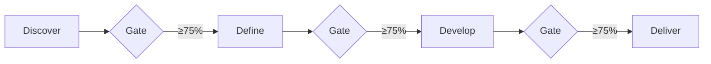

## What are workflows?

Workflows are structured patterns for coordinating multiple AI providers across phases. Unlike one-shot queries, workflows manage state, enforce quality gates, and persist decisions across sessions.

<Note>
Claude Octopus gives you workflows, not just orchestration infrastructure. These patterns are battle-tested across hundreds of projects.
</Note>


## Core workflow types

Claude Octopus includes several pre-built workflow patterns:

<Tabs>
  <Tab title="Embrace">
    ### Full Double Diamond workflow
    
    **Command:** `/octo:embrace`
    
    **Phases:** All four (Discover → Define → Develop → Deliver)
    
    **Use when:**
    - Starting a new feature from scratch
    - Need comprehensive end-to-end development
    - Want research, planning, implementation, and validation
    
    **Flow:**
    ```mermaid
    graph LR
        A[Discover] -->|Research| B[Define]
        B -->|Requirements| C[Develop]
        C -->|Implementation| D[Deliver]
        D -->|Validated| E[Shipped]
    ```
    
    **Example:**
    ```bash
    /octo:embrace build user authentication with OAuth 2.0
    ```
    
    **Duration:** 5-15 minutes  
    **Cost:** $0.10-0.30
  </Tab>
  
  <Tab title="Factory">
    ### Dark Factory (autonomous pipeline)
    
    **Command:** `/octo:factory`
    
    **Phases:** Discover → Define → Develop → Deliver → Test → Score
    
    **Use when:**
    - Spec-to-software automation
    - Autonomous development without supervision
    - Need holdout testing and satisfaction scoring
    
    **Flow:**
    ```mermaid
    graph TB
        A[Spec] --> B[Research]
        B --> C[Define]
        C --> D[Develop]
        D --> E[Deliver]
        E --> F[Holdout Tests]
        F --> G[Satisfaction Score]
        G -->|≥90%| H[Auto-ship]
        G -->|<90%| I[Human Review]
    ```
    
    **Example:**
    ```bash
    /octo:factory "build a CLI that converts CSV to JSON"
    ```
    
    **Duration:** 10-20 minutes  
    **Cost:** $0.20-0.50
  </Tab>
  
  <Tab title="Debate">
    ### Multi-AI debate
    
    **Command:** `/octo:debate`
    
    **Rounds:** 1-10 (configurable)
    
    **Use when:**
    - Need to evaluate trade-offs
    - Want adversarial perspectives
    - Comparing two or more approaches
    
    **Flow:**
    ```mermaid
    graph TB
        Q[Question] --> R1[Round 1]
        R1 --> Codex1[🔴 Position]
        R1 --> Gemini1[🟡 Counter]
        R1 --> Claude1[🔵 Analysis]
        
        Codex1 --> R2[Round 2]
        Gemini1 --> R2
        Claude1 --> R2
        
        R2 --> S[Synthesis]
        S --> V[Verdict]
    ```
    
    **Example:**
    ```bash
    /octo:debate Redis vs DynamoDB for session storage
    /octo:debate -r 3 monorepo vs microservices
    ```
    
    **Duration:** 1-3 minutes per round  
    **Cost:** $0.05-0.15
  </Tab>
  
  <Tab title="Individual Phases">
    ### Single-phase workflows
    
    Run individual Double Diamond phases:
    
    | Command | Phase | Use When |
    |---------|-------|----------|
    | `/octo:discover` | Discover | Research without full workflow |
    | `/octo:define` | Define | Scope before implementation |
    | `/octo:develop` | Develop | Implement with quality gates |
    | `/octo:deliver` | Deliver | Review and validate |
    
    **Examples:**
    ```bash
    # Research OAuth patterns
    /octo:discover OAuth 2.0 for multi-tenant SaaS
    
    # Scope requirements
    /octo:define requirements for payment integration
    
    # Implement feature
    /octo:develop user registration API
    
    # Validate implementation
    /octo:deliver review auth module
    ```
  </Tab>
</Tabs>

## Specialized workflows

Beyond core patterns, Claude Octopus includes specialized workflows:

<CardGroup cols={2}>
  <Card title="TDD" icon="vial">
    **Command:** `/octo:tdd`
    
    Test-driven development with red-green-refactor cycle
  </Card>
  <Card title="Security" icon="shield">
    **Command:** `/octo:security`
    
    OWASP vulnerability scan and remediation
  </Card>
  <Card title="Debug" icon="bug">
    **Command:** `/octo:debug`
    
    Root cause analysis and fix generation
  </Card>
  <Card title="PRD" icon="file-lines">
    **Command:** `/octo:prd`
    
    AI-optimized PRD with 100-point scoring
  </Card>
  <Card title="Review" icon="magnifying-glass">
    **Command:** `/octo:review`
    
    Multi-perspective code review with 4x10 scoring
  </Card>
  <Card title="Research" icon="graduation-cap">
    **Command:** `/octo:research`
    
    Deep multi-source research with synthesis
  </Card>
  <Card title="Parallel" icon="diagram-sankey">
    **Command:** `/octo:parallel`
    
    Launch multiple agents in parallel
  </Card>
  <Card title="Sentinel" icon="tower-observation">
    **Command:** `/octo:sentinel`
    
    GitHub-aware work monitor
  </Card>
</CardGroup>

## Autonomy modes

Workflows support three autonomy levels:

<Tabs>
  <Tab title="Supervised">
    ### Supervised mode (default)
    
    **Behavior:** Ask for approval before each phase
    
    **Use when:**
    - Learning the workflow
    - High-stakes or costly projects
    - Want control over each step
    
    **Example flow:**
    ```
    🔍 Discover phase complete
    Results: ~/.claude-octopus/results/discover.md
    
    Continue to Define phase? (y/n) █
    ```
    
    **Pros:**
    - Full control
    - Cost awareness
    - Learning opportunity
    
    **Cons:**
    - Slower execution
    - Requires human presence
  </Tab>
  
  <Tab title="Semi-Autonomous">
    ### Semi-autonomous mode
    
    **Behavior:** Continue automatically unless quality gate fails
    
    **Enable with:**
    ```bash
    export OCTOPUS_AUTONOMY=semi-autonomous
    ```
    
    **Use when:**
    - Trusted workflow
    - Medium confidence in requirements
    - Human available for escalations
    
    **Example flow:**
    ```
    ✅ Quality gate passed (82% consensus)
    🛠️ Proceeding to Develop phase automatically...
    
    ---
    
    ⚠️ Quality gate failed (68% consensus)
    Human review needed:
    - Subtask 3 failed: JWT secret strength
    - Subtask 7 failed: Rate limiting missing
    
    Retry with fixes? (y/n) █
    ```
    
    **Pros:**
    - Faster than supervised
    - Catches failures
    - Human in loop when needed
    
    **Cons:**
    - Less predictable timing
    - May interrupt at inconvenient times
  </Tab>
  
  <Tab title="Autonomous">
    ### Autonomous mode
    
    **Behavior:** Run all phases without interruption
    
    **Enable with:**
    ```bash
    export OCTOPUS_AUTONOMY=autonomous
    # or use /octo:factory command
    ```
    
    **Use when:**
    - Well-understood problem
    - High confidence in spec
    - Dark Factory mode
    - No human available
    
    **Example flow:**
    ```
    🐙 AUTONOMOUS MODE - All phases will run without approval
    
    🔍 Discover: OAuth patterns... ✓
    🎯 Define: Requirements... ✓
    🛠️ Develop: Implementation... ✓ (passed quality gate: 85%)
    ✅ Deliver: Validation... ✓ (score: 92% - SHIP)
    
    ✓ Complete! Results: ~/.claude-octopus/results/
    ```
    
    **Pros:**
    - Fully autonomous
    - No interruptions
    - Works while you sleep
    
    **Cons:**
    - No human oversight
    - May make wrong decisions
    - Higher cost if goes off track
  </Tab>
</Tabs>

## Workflow composition

Workflows can be nested and composed:

### Sequential composition



**Example:**
```bash
# Research → Plan → Execute
/octo:discover OAuth patterns
/octo:define requirements
/octo:develop implementation
```

### Parallel composition



**Example:**
```bash
# Parallel feature development
/octo:parallel --workflows "develop auth" "develop payments" "develop notifications"
```

### Conditional composition



**Example:**
```bash
# Auto-retry on failure
/octo:develop implement feature
# If quality gate fails:
/octo:debug failed subtasks
/octo:develop retry implementation
```

## Quality gates and validation

Workflows enforce quality standards at key points:

### Gate placement



### Gate criteria

<AccordionGroup>
  <Accordion title="Discover → Define gate">
    **Checks:**
    - Research completeness (≥3 sources)
    - Perspective diversity (multiple viewpoints)
    - Actionable insights (clear next steps)
    
    **Threshold:** 75% consensus
  </Accordion>
  
  <Accordion title="Define → Develop gate">
    **Checks:**
    - Clear problem statement
    - Measurable success criteria (≥3 criteria)
    - Known constraints and boundaries
    - Stakeholder agreement
    
    **Threshold:** 75% consensus
  </Accordion>
  
  <Accordion title="Develop → Deliver gate">
    **Checks:**
    - Subtask success rate ≥75%
    - Provider agreement on approach
    - No critical conflicts
    - Implementation completeness
    
    **Threshold:** 75% consensus (configurable)
  </Accordion>
  
  <Accordion title="Deliver validation">
    **Checks:**
    - Code quality score
    - Security findings (no critical)
    - Performance benchmarks met
    - Test coverage ≥80%
    
    **Thresholds:**
    - ≥90%: SHIP IT
    - 75-89%: SHIP WITH CAUTION
    - Less than 75%: DO NOT SHIP
  </Accordion>
</AccordionGroup>

## State management

Workflows persist state across phases and sessions:

### State persistence

```
.octo/
├── STATE.md              # Current phase, progress
├── decisions.json        # Architectural decisions
├── quality-gates.json    # Gate results
└── context/
    ├── discover.md
    ├── define.md
    ├── develop.md
    └── deliver.md

~/.claude-octopus/
├── results/
│   └── [session-id]/
│       ├── discover-synthesis.md
│       ├── define-requirements.md
│       ├── develop-implementation.md
│       └── deliver-validation.md
└── state.json
```

### Context passing

Each phase reads context from prior phases:

```bash
# Define phase
prior_research=$(get_context "discover")

# Develop phase  
requirements=$(get_context "define")
research=$(get_context "discover")

# Deliver phase
full_history=$(get_decisions "all")
implementation=$(get_context "develop")
```

<Info>
State persists across Claude Code plan mode context clears (v2.1.63+). Workflows automatically restore from files.
</Info>

## Workflow interruption and resume

Workflows can be paused and resumed:

### Save checkpoint

```bash
# Workflow saves state automatically at phase boundaries
# User can Ctrl+C at any time
^C

# State saved to .octo/STATE.md:
# current_phase: 2
# status: "interrupted"
# last_checkpoint: "2026-03-04T15:30:00Z"
```

### Resume workflow

```bash
/octo:resume

# Output:
# 📋 Found interrupted workflow:
#    Phase: Define (phase 2/4)
#    Last checkpoint: 5 minutes ago
#    
# Resume from Define phase? (y/n)
```

## Workflow debugging

Debug workflows with built-in tools:

### Status check

```bash
/octo:status

# Output:
# Current workflow: embrace
# Phase: 3/4 (Develop)
# Status: in_progress
# Quality gates:
#   ✓ Discover: passed (82%)
#   ✓ Define: passed (88%)
#   ⏳ Develop: in progress
#   ⏸ Deliver: pending
```

### Debug mode

```bash
export OCTOPUS_DEBUG=true
/octo:embrace build auth

# Shows:
# - Provider commands executed
# - Quality gate scores
# - Consensus calculations
# - State transitions
```

### Doctor diagnostics

```bash
/octo:doctor

# Runs 9-category health checks:
# ✓ Provider availability
# ✓ Authentication status  
# ✓ State file integrity
# ✓ Quality gate configuration
# ⚠ Codex sandbox mode: workspace-write (consider read-only)
# ✓ Cost controls configured
# ...
```

## Cost optimization

Workflows are designed for cost efficiency:

<CardGroup cols={2}>
  <Card title="Smart routing" icon="route">
    Provider router selects cheapest capable provider based on task requirements
  </Card>
  <Card title="Parallel execution" icon="diagram-sankey">
    Research and review phases run providers simultaneously (2x faster)
  </Card>
  <Card title="Prompt caching" icon="floppy-disk">
    System prompts and context cached across phases
  </Card>
  <Card title="Early exit" icon="door-open">
    Quality gates prevent wasted work on doomed paths
  </Card>
</CardGroup>

**Cost controls:**

```bash
# Set spending limit
export OCTOPUS_MAX_COST_USD=0.50

# Workflow aborts if estimated cost exceeds limit
/octo:embrace build feature
# Error: Estimated cost $0.65 exceeds limit $0.50
```

## Best practices

<AccordionGroup>
  <Accordion title="Use full workflows for new features">
    `/octo:embrace` ensures nothing is skipped. Research, planning, implementation, and validation all contribute to quality.
  </Accordion>
  
  <Accordion title="Use individual phases for iterations">
    When refining existing work, use single-phase commands (`/octo:develop`, `/octo:review`) instead of full embrace.
  </Accordion>
  
  <Accordion title="Respect quality gates">
    If a gate fails, investigate why. Forcing work through undermines the methodology and wastes downstream effort.
  </Accordion>
  
  <Accordion title="Start supervised, graduate to autonomous">
    Learn the workflow in supervised mode. Once confident, switch to semi-autonomous or autonomous for faster execution.
  </Accordion>
  
  <Accordion title="Compose workflows strategically">
    Use parallel composition for independent features. Use sequential for dependent work.
  </Accordion>
</AccordionGroup>

## Next steps

<CardGroup cols={2}>
  <Card title="Double Diamond" icon="gem" href="/concepts/double-diamond">
    Learn about the four-phase methodology
  </Card>
  <Card title="Personas" icon="users" href="/concepts/personas">
    Understand specialized agent personas
  </Card>
  <Card title="Commands reference" icon="terminal" href="/commands/overview">
    Browse all 39 workflow commands
  </Card>
  <Card title="Get started" icon="rocket" href="/quickstart">
    Install and run your first workflow
  </Card>
</CardGroup>